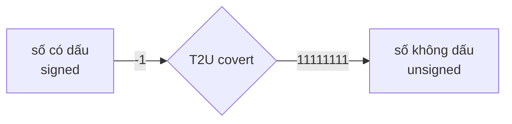
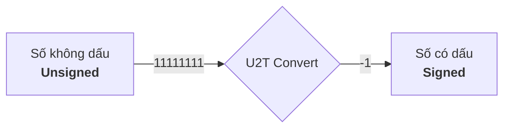
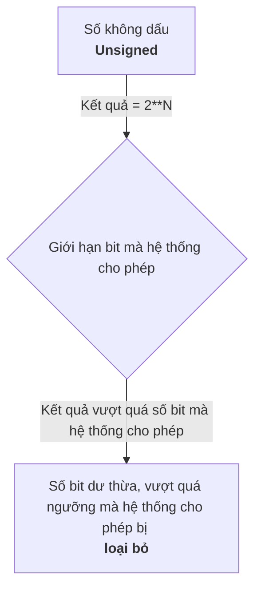

# CSAPP : mã bù hai và tràn số

> bắt đầu viết vào ngày : 15/6/2026

> hoàn thành vào ngày : 

**mục lục**

- 1.[Mã bù hai](#mã-bù-hai)

	- 1.1.Mã bù hai là gì ? *(Two's Complement Encodings, 2.2.3 trang 99,100)*

	- 1.2.Cách đọc bit parrent sang số nguyên ? *(Unsigned Encodings, 2.2.2 trang 97,98)*

	- 1.3.Miền giá trị biểu diễn được

	- 1.4.Chuyển đổi giữa unsigned và signed *(Conversions Between Signed and Unsigned, 2.2.4 trang 105,106)*

- 2.[Tràn số](#tràn-số)

	- 2.1 signed overflow và unsigned overflow

	- 2.1.1 unsigned overflow

	- 2.1.1.1 modulo $$\Large2^{N}$$

	- 2.1.1.2 cờ CF (carry flag)

	- 2.1.1.3 Vì sao phép cộng unsigned lại tương đương modulo $$\Large2^{N}$$?

	- 2.1.1.4 vì sao unsigned arithmetic chính là modulo $$\Large2^{N}$$?

	- 2.1.2 signed overflow

	- 2.1.2.1 vượt miền Tmin/Tmax

	- 2.1.2.2 cờ OF (overflow flag)

	- 2.1.2.3 vì sao MSB đổi?

	- 2.1.2.4 áp dụng thử vào C

---

# Mã bù hai

**1.1.Mã bù hai là gì?**

- Mã bù hai Bit MSB có trọng số $$\Large−2^{w−1}$$ biểu thức này dùng để tính Tmin của binary , các bit còn lại có trọng số dương như bình thường

- là cách biểu diễn signed của trọng số MSB luôn là số âm. Nghĩa là, nếu `MSB = 1` đó là số âm còn `MSB = 0` thuộc miền không âm (số 0) hoặc dương

**1.2. Cách đọc bit parrent sang số nguyên ?**


> trích từ sách CS:APP

chúng ta thấy có cái `SIGMA`, đó là công thức tính giá trị của một cái đoạn nhị phân signed ra số nguyên. Nghĩa là, 1 đoạn nhị phân `0001` ra số nguyên là `1` nhưng đoạn `1001` lại ra `-7` tại sao?

- thay vì dùng sigma như trong sách, ta sẽ tính thủ công trọng số và bit để xem cách hoạt động của nó :

giả sử ta có một đoạn nhị phân 13 bit signed có MSB là 1 : `1001001100010`

và một đoạn nhị phân 12 bit signed nhưng lại có MSB là 0 : `011011000100`

vậy ta sẽ tính toán nó để xem result của nó về số nguyên là gì :


với đoạn nhị phân 1 là `1001001100010` ta lập bảng :

| Bit vị trí | 12 | 11 | 10 | 9 | 8 | 7 | 6 | 5 | 4 | 3 | 2 | 1 | 0 |
|------------|----|----|----|---|---|---|---|---|---|---|---|---|---|
| bit        | 1  | 0  | 0  | 1 | 0 | 0 | 1 | 1 | 0 | 0 | 0 | 1 | 0 |


Trọng số lần lượt các bit : -4096 (Số MSB) , 2048, 1024... 

- cứ thế chia 2 lần lượt tới bit LSB, hoặc đơn giản dùng lũy thừa:

 $$\Large2^{N}$$

- trong đó :

	- `2` : là cái hệ cơ số của binary ý

	- `N` : là các vị trí bit

Ví dụ : $$\Large2^{12} = 4096$$ (tại sao làm việc ở mức MSB signed mà ta không thêm âm? do là mã bù hai bit MSB vốn đã có trọng số âm rồi) , bằng chứng cho kết quả :


- Để tiết kiệm thời gian, ta chỉ lấy những bit vị trí có bit là `1` thôi, chỉ xét các bit có giá trị 1 vì các bit 0 không đóng góp vào tổng trọng số. Dựa trên bảng bit thì chúng ta có những vị trí và trọng số của các bit 1 :

| Bit vị trí | 12 | 9 | 6 | 5 | 1 |
|------------|----|---|---|---|---|
| Trọng số   |  -4096 | 512 | 64 | 32 | 2 |


ta có lần lượt các trọng số bit 1 như sau : `-4096 , 512 , 64 , 32 , 2`

Và ta tiến hành cộng chúng lại để ra giá trị của chúng : `(-4096) + 512 + 64 + 32 + 2 = -3486` giá trị của bit `1001001100010` là `-3486`


vậy còn số nhị phân `011011000100` ta lập bảng :

| Bit vị trí | 11 | 10 | 9 | 8 | 7 | 6 | 5 | 4 | 3 | 2 | 1 | 0 |
|------------|----|----|---|---|---|---|---|---|---|---|---|---|
| số bit     | 0  | 1  | 1 | 0 | 1 | 1 | 0 | 0 | 0 | 1 | 0 | 0 |
| Trọng số   | bỏ | 1024 | 512 | bỏ | 128 | 64 | bỏ | bỏ | bỏ | 4 | bỏ | bỏ |


từ bảng ta có làn lượt là : `1024 , 512 , 128 , 64 và 4`

tính tổng lại : `1024 + 512 + 128 + 64 + 4 = 1732`


**1.3.Miền giá trị biểu diễn được**

- Miền gía trị biểu diễn được là định nghĩa một dãy binary nó có thể chứa trọng số thấp nhất (MIN) và trọng số cao nhất (MAX) là bao nhiêu tính từ âm đến dương. Ví dụ với một dãy binary 4 bit :

4 bit có miền giá trị âm `1000` MSB = 1, tới dương `0111` MSB = 0 và để biết số nguyên nhỏ nhất và cao nhất thì ta có hai cách :

- 1. là chúng ta đếm thủ công hoặc là dịch binary ra ở các trang website, hoặc là dùng lệnh để dịch ra số nguyên

- 2. là chúng ta sử dụng biểu thức mà kiến trúc máy tính, CSAPP thường hay đề cập tới. Tính số nguyên cao nhất của binary 4 bit, ở đây ta dùng công thức là $$\Large2^{N}-1$$, nói sơ qua về công thức này thì:

	- `2` : là hệ cơ số của binary

	- `N` : là số lượng bit ví dụ ta muốn tính 4 bit như `0000 -> 1111` thì ta đưa số 4 vào

	- `-1` : bởi vì ta đếm từ số 0, nên N bit tạo ra hai giá trị khác nhau chênh lệch là 1.Nên giá trị lớn nhất của dãy binary là $$\Large2^{N}-1$$

Như thế công thức này dùng để tính giá trị của dãy nhị phân không dấu unsigned là `1111` nhưng chúng ta muốn tính dãy nhị phân có dấu signed là `0111` mà ? vậy thì chúng ta thực hiện trừ 1 thêm đi cho phép lũy thừa, phép toán chỉ xem và tính các dãy bit còn lại và không tính bit MSB , kết quả của biểu thức sẽ như vậy : $$\Large2^{N-1}-1$$

Và chúng ta tiến hành thực hiện tính toán : $$\Large2^{N-1}-1 = 7$$ và giá trị 7 này chính là giá trị lớn nhất của hệ binary 4 bit


vậy còn giá trị nhỏ nhất thì sao?

- Giá trị nhỏ nhất là phần mà bit MSB chạm 1, nghĩa là ta có `0111` là phần bit lớn nhất của số dương theo hệ có dấu signed rồi nhưng ta cộng 1 bit nữa là `1000` MSB = 1 , số âm là `-8` thì đó chính là phần nhỏ nhất rồi. Tương đương với công thức $$\Large-2^{N-1}$$

vậy từ các phép tính trên thì miền giá trị là `[-8 , 7]` theo số nguyên

một vài lưu ý mà tôi được thẩm từ cuốn CSAPP là, miền giá trị theo hệ signed mã bù hai là **không đối xứng** ví dụ ta có:

| miền giá trị 4 bit | -8 | -7 | -6 | -5 | -4 | -3 | -2 | -1 | 0 | 1 | 2 | 3 | 4 | 5 | 6 | 7 |
|--------------------|----|----|----|----|----|----|----|----|---|---|---|---|---|---|---|---|

tất nhiên theo bản, bạn thấy nó có 8 số âm và 8 số không âm nên là `TMin = -8` và `TMax = 7` vì sao bạn thấy có 8 số âm và không âm đều đều cả hai nhưng TMin và TMax lại có sự chênh lệch là 1 đơn vị ?

- **Nguyên nhân chính là số 0** số 0 thuộc miền không âm nhưng không làm tăng giá trị Tmax

> [!NOTE]
> Chúng ta cảm thấy rất khổ dâm khi mà phải lập bảng hay tính tay từng bit, vậy nên muốn tính theo cách thực tế thì dùng lệnh C `printf "%u\n" 0b<binary>` ví dụ `printf "%u\n" 0b10010010` kết quả là 146 nếu ta muốn tính unsigned hệ ko dấu. Vậy muốn signed hệ có dấu thì lệnh `printf "%d\n" (signed char)0b<binary>` ví dụ `printf("%d\n", (signed char)0b10010010);` thì kết quả là `-110` , nhưng signed thì phải tạo file C vì bash thuần ko hỗ trợ việc ép kiểu. Bạn có thể dùng alias trong file .bashrc hoặc .zshrc hay là alias tạm để gắn tham số vào cũng được. Ngoài ra cũng có thể dùng `echo $((2#<binary))` ví dụ `echo $((2#10010010))` kết quả cũng ko đổi là 146 nhưng hệ có dấu thì echo cũng chịu

> Áp dụng thử vào C, bạn có thể bỏ qua nếu ko quan tâm đến 

<details>
	<summary>Áp dụng thử vào C</summary>
- Nếu như ở trên là lý thuyết?, chúng ta tiến hành viết một chương trình C nhỏ để có thể tính toán các dãy bit trên hệ thống thật . Do hệ thống thật là 64 bit nhưng trong C các kiểu dữ liệu nó có 1 cái hay là có riêng cho nó một lượng byte riêng ví dụ `2 byte` là `short`, chúng ta sẽ ứng dụng short vào trong chương trình này. Cứ dịch ra trước `2 byte là 16 bit` và tính toán TMin và TMax trước đi đã

Tmin của 16 bit = $$\Large-2^{N-1}$$ = -32768

Tmax của 16 bit = $$\Large2^{N-1}-1$$ = 32767


```c
#include <stdio.h>

int main(void){
	short numbers = 32767; //là số Tmax của biến short 

	numbers += 1; //lúc này sẽ ra Tmin của short

	printf("%d\n",numbers);

	return 0;
}
```


Nó hoạt động đúng như những gì mà sách nói cũng như kỳ vọng của tôi

> Ghi chú : ở đây theo chuẩn CPU hầu hết các thiết bị hiện đại thì nó đều dùng bù hai nên như bạn thấy trong ảnh là kết quả đúng là Tmin của 16bit, nhưng với theo cách nhìn của lập trình C điều này là UB vì phép toán này thuộc nhóm signed overflow

tương tự với nhiều kiểu dữ liệu có dấu khác:

| Kiểu        | Bit | Tmin                 | Tmax                |
| ----------- | --- | -------------------- | ------------------- |
| signed char | 8   | -128                 | 127                 |
| short       | 16  | -32768               | 32767               |
| int         | 32  | -2147483648          | 2147483647          |
| long long   | 64  | -9223372036854775808 | 9223372036854775807 |

> Debug chương trình C, nếu bạn ko quan tâm có thể bỏ qua

<details>
	<summary>Debug program C</summary>
chúng ta cùng debug nó xem cái gì nó đang thực sự diễn ra bên trong. Ở đây, chúng ta dùng công cụ GDB để debug từng dòng assemly :

> gdb -q test_type

và

> start

xong lệnh start nó sẽ thực thi tới đầu main nếu program còn symbol và chưa bị strip 


ở đoạn disassembly, chúng ta thấy pwndbg nó có hiện sẵn các vaddr và hexdecimal, tính cộng như trong ảnh


để có bằng chứng chương trình thực hiện đúng cơ chế và lý thuyết y như CSAPP nói và output thì chúng ta soi kỹ cách disassembly được đưa ra từ gdb nó cộng lại như thế nào và hoạt động nhị phân nó ra làm sao ở đây dựa trên các đoạn hợp ngữ trong ảnh, chúng ta chú ý tới phần này :

```asm
   0x555555555147 <main+14>    movzx  eax, word ptr [rbp - 2]        EAX, [0x7fffffffe54e] => 0x7fff
   0x55555555514b <main+18>    add    eax, 1                         EAX => 0x8000 (0x7fff + 0x1)
   0x55555555514e <main+21>    mov    word ptr [rbp - 2], ax         [0x7fffffffe54e] <= 0x8000
```

ở đây tại instrution `0x5147` ta thấy thanh ghi eax hiện tại đang chứa `0x7fff` chính là Tmax của kiểu dữ liệu 16 bit, để kết luận 0x7fff chính là Tmax thì ta có bằng chứng như sau :


bạn thấy nó là dãy `111111111111111` và kết luận MSB = 1 rồi đúng không? tuy nhiên kết luận đó chưa đúng, tiếp theo xét instrution `0x514e` ta thấy sau khi nó cộng một đơn vị thì nó có giá trị `0x8000` đó chính là Tmin của binary 16bit, chứng minh nó là Tmin ta có bằng chứng như sau: 


giờ đây quan sát hai giá trị tmax và tmin , chúng ta lấy output ở ảnh 0x8000 là `1000000000000000` đi so sánh với ảnh trước là `111111111111111`, bạn thấy nó chênh lệch 1 đơn vị và phần `111111111111111` nó thấp hơn 1 đơn vị. Để dễ dàng cho việc so sánh ta sẽ sắp xếp nó và thêm số 0 vào cho chuẩn 16 bit  :

| Tmax |0111111111111111|
|------|----------------|
| Tmin |1000000000000000|

- Bạn thấy MSB của cả hai bị chênh lệch 1 đơn vị, và bây giờ chúng ta `ni` tiếp tới printf() được gọi xem cái gì diễn ra


chúng ta thấy có một điểm lạ, tại sao nó lại thêm `0xffff` vào ?

> đoạn này giải thích câu hỏi và thiên hướng về C có thể hơi ngoài lệ, bạn có thể bỏ qua nếu không quan tâm tới

<details>
	<summary>Lý do C lại thêm 0xffff</summary>

- Bởi vì trong C có cơ chế interger promotion, khi ta truyền type short vào printf, nó sẽ tự động ép sang kiểu int. Mà, tại vì sao nó phải làm vậy?

**trước hết chúng ta phải hiểu variadic function trong C là gì đã**

- Variadic function trong C, có tác dụng nhận các tham số không cố định, thường được khai báo trong các tập tin tiêu đề header (.h) thường ở các thư viện, nhận diện chúng bằng cách thấy ký hiệu `...` ở các slot argument kế tiếp. Mục đích của cái này là tiếp nhận tất cả biến có kiểu dữ liệu khác nhau, ví dụ hình hài của nó theo tiêu đề được khai báo sẵn trong hệ thống linux :


> gọn hơn : dấu ... nghĩa là sau các tham số cố định, có thể truyền thêm bao nhiêu đối số tùy ý.

**Nếu như thế thì nó liên quan gì tới việc thêm 0xffff vào vaddr?**

- Khi ta truyền short vào printf, nó không biết đó là short nó chỉ biết một đống đối số sau `const char` và chuẩn C quy định, trước khi truyền vào hàm variadic thì các kiểu dữ liệu sau bị ép sang int :

| các type bị ép sang int |
|-------------------------|
| signed char | 
| unsigned char | 
| unsigned short |
| char |
| short |

Còn float thì bị ép thành double. Vậy ép xong rồi sao nó thêm `ffff`?

- phải nhắc tới `sign extension` ở đây. Chúng ta cần biết sign extension là sao đã, nó là một loại có thể kéo các dải bit khi thực hiện tăng các bit lên, dễ hiểu hơn là tôi sẽ cho một bảng như sau :

| bit gốc 		 | 1000 | 100 | 10 |
|----------------|------|-----|----|
| bit được tăng độ rộng toán hạng | 00001000 | 0000100 | 000010 |
| sign extension | 11111000 | 1111100 | 111110 |

ví dụ tôi cho nó là kiểu `a` đi, kiểu `a` có 4 bit là `0000 -> 1111`, bây giờ tôi cho kiểu `a` có giá trị là $$\Large Tmin = -2^{N-1}$$ là `1000` đó là hình hài bit của nó. Vậy khi kiểu `a` ta ép kiểu nó sang kiểu `b` và kiểu b 8 bit (gấp đôi bit kiểu a) thì lúc này độ rộng toán hạng của nó là `11111000`. Đó là lý do đợt chạy debug vừa rồi nó thêm `0xffff` vì kiểu `short` theo quy định của C nó được ép sang kiểu `int` mà int gấp đôi short là 4 byte trong khi short có 2 byte thôi 

điều kiện để sign extension nó làm việc là MSB = 1 còn nếu MSB = 0 thì đó là của zero extension làm việc, nếu sign nó kéo dài với bit 1 thì zero kéo dài với bit 0 thôi


</details>

chúng ta tiếp tục `ni` và output sẽ giống y chang :


vì đơn giản đó là Tmin theo signed, và khi MSB = 1 rồi thì mọi con số đều là âm hết nếu theo hệ bù hai signed
 
</details>

</details>

**1.4.Chuyển đổi giữa unsigned và signed**

- Mọi binary ví dụ `11111111` đều có thể được diễn giải khác nhau tùy kiểu dữ liệu, bù hai signed diễn giải nó là `-1` nhưng theo unsigned nó là `255` nhưng bit nó vẫn là `11111111` không thay đổi ở bậc nhị phân, chỉ có cách diễn giải mới là bậc thay đổi vì thế gía trị cũng thay đổi theo

- chỉ là diễn giải cách đọc khác nhau khi làm việc với bit. Ví dụ :

ta có số `10` bây giờ hãy đọc nó theo hệ thập phân `mười` nhưng đọc nó theo hệ nhị phân `hai` số đó vẫn là `10` không chỉnh gì thêm chỉ khác cách đọc. Cách sát hơn nữa là `unsigned` và `signed`, ta có bảng so sánh như sau :

|binary | 11111111 | 10000001 | 10 |
|-------|----------|----------|----|
| signed | -1 | -127 | -2 |
| unsigned | 255 | 129 | 2 |

dựa theo bảng, chúng ta có thể thấy bit vẫn là bit, nó vẫn giữ nguyên đó không chỉnh sửa. Nhưng, giá trị bị thay đổi bởi vì 2 cách đọc hệ khác nhau 

- Ở trong sách CS:APP, người ta còn đề cập tới là chuyển đổi kiểu đọc giữa unsigned và signed


nhìn vào dòng mã mà họ đưa trong sách :

```c
For example, consider the following code:

 	short int v = -12345;
 	unsigned short uv = (unsigned short) v;
	printf("v = %d, uv = %u\n", v, uv);
```

> When run on a two’s-complement machine, it generates the following output:

> v = -12345, uv = 53191

Chúng ta có thể hiểu theo minh họa là, khi ta khai báo cái biến `v` với số âm = -12345 thì nó vẫn là số âm, nhưng khi ta ép nó sang unsigned là `unsigned short uv = (unsigned short) v;` thì nó chuyển sang gía trị khác là số dương nhưng số bit vẫn giữ nguyên. Vậy bằng chứng nào mà tôi dám nói số bit giữ nguyên? ta sẽ chứng minh nó. Ở đây sách đã cho output và đoạn mã, ta sẽ thử thực thi lại xem ra output terminal và chứng minh nó :

> phần chứng minh, nó có thể hơi ngoài lề bạn có thể bỏ qua

<details>
	<summary>Chứng minh</summary>

code của tôi lấy cảm hứng ví dụ như trong code minh họa CS:APP cung cấp :

```c
#include <stdio.h>

int main(void){

	short int v = -12345;
 	unsigned short uv = (unsigned short) v; // code y nguyên như trong sách 
	printf("v = %d, uv = %u\n", v, uv);

	return 0;
}
```

> gcc -o test_type test_type.c


Như trong ảnh, output đã chính xác như sách đưa. Vậy tới phần chứng minh là binary có phải giữ nguyên như tôi nói không, hay các lý thuyết như trong sách có vận hành đúng không ta sẽ chứng minh nó bằng cách dịch số nguyên không dấu sang nhị phân và thực hiện tính toán :

> echo "obase=2; $((53191))" | bc


số nhị phân là `1100111111000111` 16 bit đúng type của short là 2 byte, giờ tới phần tính toán số có dấu xem kết quả tính toán có đúng như tôi nói là số nhị phân giữ nguyên ko nhé :

tính toán bit có dấu signed 

| vị trí bit | 15 | 14 | 13 | 12 | 11 | 10 | 9 | 8 | 7 | 6 | 5 | 4 | 3 | 2 | 1 | 0 |
|------------|----|----|----|----|----|----|---|---|---|---|---|---|---|---|---|---|
| số bit     | 1  | 1  | 0  | 0  | 1  | 1  | 1 | 1 | 1 | 1 | 0 | 0 | 0 | 1 | 1 | 1 |
| value = $$2^{N}$$ | -32768 | 16384 | bỏ | bỏ | 2048 | 1024 | 512 | 256 | 128 | 64 | bỏ | bỏ | bỏ | 4 | 2 | 1 |

từ value trên bảng cộng tổng lại : `(-32768) + 16384 + 2048 + 1024 + 512 + 256 + 128 + 64 + 4 + 2 + 1 = -12345`


kết quả ra `-12345` chính xác với kết quả mà CSAPP cho. Suy ra, kết luận của tôi `binary giữ nguyên` là đúng


</details>

từ đó cũng như thế thôi, bit nhị phân vẫn y nguyên là nó. Cách đọc mới quyết định giá trị của nó là gì và chính cách đọc mới thay đổi, chúng ta có thể chuyển đổi được cách đọc bởi vì nhị phân đã đổi đâu? nên đọc một đoạn mã đó vẫn có thể thây đổi được

> nếu bạn cần tìm hiểu thêm về T2U và U2T thì có thể đọc

<details>
<summary>T2U và U2T</summary>


trong CSAPP có đề cập tới hai khái niệm này. T2U có nghĩa là chuyển số có dấu signed sang số không dấu unsigned 

<details>
	<summary>sơ đồ</summary>



</details>

trước hết ta có biểu thức của T2U là :

nếu **x < 0** thì

 $$\Large x + 2^{N}$$

nếu **x >= 0** thì

 vẫn **giữ nguyên x**

trong đó x là **giá trị số nguyên N** là số bit $$\Large2^{N}$$ là biểu thức **tính gía trị bit tràn** ví dụ 4 bit nó sẽ tính `10000` là bao nhiêu cái $$\Large2^{N}$$ khác với $$\Large2^{N}-1$$ là nó tính **số bit tràn** `10000` còn biểu thức `-1` kia ý là **tính toàn diện bit** `1111`. Nói sơ qua thì T2U chủ yếu covert cái số có dấu (signed) sang không dấu (unsigned) điển hình là số âm sang số dương, nếu số âm thì nó sẽ chuyển đổi còn nếu số dương thì nó giữ nguyên gồm cả 0.


số bit của short là 16bit, vậy ta biết số có dấu Tmin của 16bit là $$\Large-2^{16 - 1} = -32768$$ do `-32768` bé hơn `0`, bây giờ ta muốn chuyển chúng sang hệ không dấu unsigned thì ta dùng biểu thức T2U :

$$\huge(-32768) + 2^{16} = 32768$$


còn nếu mà số nguyên như 100 lớn hơn 0 thì giữ nguyên. Nó sẽ là kết quả bị sai dù covert đúng hay không nhưng về bản chất là sai, không phải vì biểu thức sai mà vì điều kiện không cho phép áp dụng biểu thức với điều đó

Vậy ví dụ ta thử tính xem chuyện gì xảy ra biết rõ ràng 100 lớn hơn 0, điều kiện ko cho phép vậy ta vẫn cứ tính xem có gì?

$$\huge100 + 2^{16} = 65636$$ **(kết quả bị sai dù covert đúng)**

Bạn thấy số đã chuyển sang số không dấu unsigned

còn U2T thì ngược lại thôi, nó chuyển unsigned sang signed 

<details>
	<summary>sơ đồ</summary>



</details>

công thức của nó là :

nếu **x <** $$\Large2^{N-1}$$ thì

giữ nguyên

nếu **x >=** $$\Large2^{N-1}$$ thì

$$\Large x - 2^N$$

trong đó x là **số bit** , nếu như x mà **nhỏ hơn Tmax** của binary thì giữ nguyên còn mà nếu x mà **lớn hơn Tmax** của binary thì dùng công thức U2T .Ví dụ với cái bit như trên là 16 bit đi :

ở đây cho x = 32768 , 32768 **bằng** với $$\Large2^{N-1} = 2^{16-1} = 32768$$ lúc này ta mới dùng biểu thức U2T :

$$\huge32768 - 2^{16} = -32768$$ **(Bạn thấy nó đã covert sang âm)**


còn mà nếu ta dùng số nguyên bé hơn Tmax của binary thì không được, ví dụ ta có số nguyên là 100 bé hơn $$\Large2^{N-1} = 2^{16-1} = 32768$$ thì thử tính :

$$\huge100 - 2^{16} = -65436$$ **(suy ra nó sai dù vẫn là convert nhưng kết quả nó bị sai)**

Nên là hai cái U2T và T2U đều có điều kiện rõ ràng mới có thể tính ra kết quả chính xác được

Bạn thấy nó đã chuyển lại sang âm rồi, vậy tôi cũng đang thắc mắc là 

**chúng ta có thể thêm âm thủ công được mà? cần gì tới mấy công thức này cho rườm rà, vậy mục đích của CSAPP muốn dạy chúng ta là mấy biểu thức này và liệu nó có tác dụng gì?**

- CPU chỉ hiểu chuỗi bit 0 và 1, nó không biết số nào là âm hay dương. Cùng một dãy bit, tùy thuộc vào cách diễn giải (signed hay unsigned) mà giá trị sẽ khác nhau. T2U và U2T chính là hai công thức toán học mô tả sự thay đổi giá trị đó.

- U2T và T2U giúp ta biết chương trình thế nào nếu đổi cách đọc. Ví dụ điều kiện so sánh, khi so sánh `-1 < 1U` thì đâu biết compile nó tối ưu những gì đâu ? nếu nó tối ưu `-1` là unsigned thì short 16bit `1111111111111111` là một số khác, tính công thức $$\Large2^{16}-1$$ là `65535` thì `65535 < 1` là sai lúc đó else luôn đúng. Logic bị bẻ cong

- CSAPP dạy hai biểu thức này không phải tính thủ công từng cái một, mà là để dự đoán và debug một chương trình dễ dàng hơn khi gặp mấy trường hợp diễn giải binary của chương trình.

> Phần debug để chứng minh chương trình tối ưu hóa và phá logic bởi cách đọc là như thế nào , bạn có thể bỏ qua nếu ko quan tâm đến

<details>
	<summary>Debug chứng minh bug signed,unsigned</summary>

```c
#include <stdio.h>

int main(void){
		if(-1 < 1U){
			printf("hợp lệ \n");
		}else{printf("ko hợp lệ, lỗi diễn giải\n");}
	return 0;
}
```

> gcc -o test_type test_type.c


như trên ảnh, lỗi đã xảy ra. Lý do sao nó xảy ra thì chúng ta tiến hành debug nó 

> gdb -q ./test_type

và

> start

chúng ta sẽ ở instrution là `0x55555555513d` nghĩa là bắt đầu logic sau khi đã push và lưu thanh ghi rbp.


ở đây có điều bất ngờ là trong C gốc có điều kiện so sánh if nhưng disas ra lại thấy như này 


nó hardcode mặc định trong chương trình là `"ko hợp lệ, lỗi diễn giải\n"` với puts trực tiếp và thoát, ko có điều kiện nào ở trong đó. Chứng minh vấn đề là đây nhưng quan trọng nhất là tại sao nó lại hardcode, chúng ta tiến hành debug quá trình compile gcc biên dịch chương trình của chúng ta ra sao.

> gcc -save-temps -fdump-tree-original test_type.c -o test_type

chúng sẽ biên dịch lại nhưng sẽ tạo các file soi quá trình biên dịch như sau :


- file đuôi .i : là file ghi lại compiler xóa hết ghi chú comment và chỉ thị có dấu như # như #include #define, chúng sẽ chèn tất cả code thư viện lên đầu dòng mã.

- file đuôi .s : là file hợp ngữ assembly

- file đuôi .o : là file nhị phân liên kết, dùng để liên kết bằng ld 

- file đuôi .original : là file chương trình mà compile log lại trước khi dịch chúng sang mã máy để thực thi

Bây giờ, chúng ta tiến hành `cat` file .original ra trước :

> cat test_type.c.006t.original


Bạn thấy `if(0)` hardcode thẳng là 0 luôn cơ mà, nghĩa là compile đã thực hiện trước đó rồi, trước cả khi log các file này lại còn về phía printf, các sequences đều bị enocode thành các mã opcode. Bây giờ chúng ta tiến hành soi cái file .s là file hợp ngữ ra xem sao :

> cat test_type.s


Quan sát, assembly att mà compile dịch ra có thể hơi khác so với cái mà ta gặp hằng ngày, nhưng vấn đề là ta thấy logic của assembly nó ko hề có các câu điều kiện như `je` , `jne` v.v. mà chỉ là gắn vào rdi rồi call xong thoát. Đó là bằng chứng mạnh nhất để cho thấy trước khi các file log này được sinh ra thì compile đã tối ưu hóa và loại bỏ các câu điều kiện trước đó nữa rồi. Chúng ta cần debug sâu hơn nữa

Trích xuất tất cả các file debugs ra với lệnh :

> gcc -fdump-tree-all test_type.c -o test_type

nó sẽ ra các file như thế này. Các file này đều được push hết lên phần /debugs/


Ở đây, rất nhiều file. Chúng ta chỉ trinh thám mấy file cần thiết để lấy bằng chứng chứng minh compiler optimized chương trình, các file chúng ta có thể trinh thám là `test_type.c.273t.optimized`, `test_type.c.006t.original`, `test_type.c.024t.ssa`, `test_type.c.007t.gimple` hoặc đơn giản chúng ta dùng lệnh `grep` để grep tất cả file cho nhanh :

> grep -R "if" test_type.*


ở đây, tại các file mã nguồn .c và .i vẫn là nó, .c là gốc mã nguồn còn .i thì compiler chỉ trích xuất và chèn tất cả nội dung của file tiêu đề lên đỉnh của src gốc thôi nó chưa động chạm gì tới mã nguồn, nhưng về các file sau nghĩa là giai đoạn sau đó thì if bắt đầu biến thành `if(0 != 0)`. Rõ ràng là compiler nó đã chuyển sang 0 trước đó nữa rồi

chúng ta thử đổi ngược lại câu điều kiện xem sao :

```c
#include <stdio.h>

int main(void){
		if(-1 > 1U){ //đổi ngược < thành >
			printf("hợp lệ \n");
		}else{printf("ko hợp lệ, lỗi diễn giải\n");}
	return 0;
}
```

> gcc -o test_type test_type.c


chúng ta quan sát, thấy in ra từ hợp lệ. Vậy điều kiện `-1 > 1U` hay `-1 < 1U` thì khi biên dịch, compiler sẽ đổi cách đọc nó sẽ dựa trên tiêu chuẩn C để đổi cách đọc `-1` hệ có dấu sang hệ không dấy , lúc này nó là số âm nhưng khi bị ép sang hệ không dấu unsigned thì nó sẽ ra số nguyên dương = $$\Large2^N-1$$ bao quát toàn bộ dãy binary. Nên `-1` thành số lớn hơn rất nhiều ví dụ :

- ta có một đoạn mã C nhưng nó khai báo short 2byte là 16bit, điều kiện so sánh là `-1 < 1U`, compiler ép `-1` sang usigned gọi là `(unsigned)-1 < 1U` lúc này 16 bit có số nguyên bằng $$\Large2^{16}-1 = 65535$$ thì ta đang so sánh `65535 < 1` nên điều kiện luôn sai. Thì hai đoạn trên cũng thế, chỉ là compiler và chuẩn C sẽ thực hiện ép sang int thôi.


**Vậy vai trò của T2U và U2T ở đây là gì? có hai đoạn mã vậy chúng ta có thể vận dụng nó vào đó như thế nào?**

- Vai trò của T2U và U2T là dự đoán trước điều gì xảy ra khi dùng `-1 > 1U`, vì `-1 < 0` chúng ta có thể tính ra số kết quả bằng T2U với biểu thức $$\Large x + 2^{N}$$. **Nhưng vấn đề là tính ra số, nhưng làm sao để biết được cái nào cần nên tính. Ví dụ khi -1 được so sánh với 1U thì làm sao chúng ta có thể biết được là phép này là lỗi, phép này tính bằng T2U v.v.?** , vấn đề là khi khai báo `-1 > 1U` thì người bình thường rất dễ hiểu lầm và cho ra ngay kết quả toán học, nhưng ko ai biết được sau compile nó làm cái gì? từ đó khi chương trình thực thi nó sẽ ra kết quả là sai, đối nghịch và xung đột với sự kỳ vọng của họ, còn về phần cái nào cần nên tính thì chúng ta cần nhìn về kiểu dữ liệu, trong compile và chuẩn C khi thấy so sánh hai hạng khác kiểu hệ ví dụ `unsigned so sánh với signed` thì nó sẽ đổi kiểu đọc một trong hai kiểu so sánh sao cho chúng cùng hạng kiểu ví dụ `signed so sánh signed` hoặc `unsigned so sánh unsigned` , binary vẫn ở đó chỉ kiểu đọc thay đổi và giá trị cũng thay đổi theo điều này nói rõ ở mục `1.4.Chuyển đổi giữa unsigned và signed` . Vì thế T2U mới xuất hiện dùng để dự đoán trước kết quả so sánh

- T2U và U2T không phải là hai phép tính để thêm dấu này thêm dấu kia, nó đảm nhiệm vai trò là dự đoán kết quả trước khi compile được thực thi đúng hơn là CSAPP dạy cho người đọc hiểu cách compile hoạt động. Bởi lẽ, khi dự đoán được chính xác cái gì trước khi compile biên dịch nó thì chả phải đang hình dung và đọc chương trình như một compiler rồi sao?

</details>

> CPU nó không giữ một đống số nguyên hay gì hết, nó chỉ giữ một đống bit chỉ 0 và 1 quan trọng hơn nó không có khái niệm là âm hay dương chỉ có khái niệm bit. Về cơ bản, T2U và U2T chỉ giúp cho con người có thể dự đoán chính xác cái gì sẽ xảy ra khi làm việc với hệ số có dấu, ko dấu, kiểu đọc. Nó giúp chúng ta hiểu hơn về cách compiler biên dịch chương trình

</details>

**Vì sao gọi là mã bù hai?**

> chủ yếu là lịch sử của nó, bạn có thể bỏ qua nếu ko quan tâm tới

<details>
	<summary>vì sao gọi là mã bù hai</summary>
- Lúc đầu người ta tạo ra `mã bù một` loại mã bù một này diễn giải số âm bằng cách đảo bit . Ví dụ lấy `5 + (-5)` thì 5 có binrary là `0000101` và (-5) thì đảo bit lại là `1111010` và lấy hai phép đó cộng lại :

| số 5 | 0000101 |
|------|---------|
| số (-5) sau khi đảo bit | 1111010 |
| kết quả cộng lại | 1111111 |

nó không ra 0, kết quả đã sai rồi còn phải cộng thêm carry quay về rất phiền

- Sau đó, họ quyết định thử thêm sẳn cộng 1 vào xem thế nào. Ở đây, họ đảo bit và sau đó cộng thêm 1 ngay khi tạo số âm :

| số 5 | 0000101 |
|------|---------|
| số (-5) sau khi đảo bit | 1111010 |
| kết quả sau khi cộng thêm 1 | 1111011 |
| kết quả cộng lại | 10000000 |


bỏ bit ngoài đi, chúng ta có kết quả là 0. Đó là bù hai

> Phần này chủ yếu là lịch sử của bù hai
</details>

---

# Tràn số

- Tràn số là hiện tượng các số bit được dịch hoặc được cộng lên sang bên trái :

| số bit gốc | 00010001 |
|------------|----------|
| cộng 1     | 00010010 |
| dịch phải 1 | 00100010 |

- Điều đó bình thường và ko sai, nhưng sẽ có hậu quả nếu nó xảy ra hiện tượng ví dụ `overflow` , `signed wrap` . Thế hai hiện tượng này là gì?, overflow gồm hai phần `signed overflow` và `unsigned overflow` . còn signed wrap

**2.1 signed overflow và unsigned overflow**

**2.1.1 unsigned overflow**

<details>
	<summary>sơ đồ</summary>



</details>

- Là hiện tượng khi số nguyên không dấu tới quá hạn của số bit mà hệ thống cho phép. Nghĩa là, ví dụ khi hệ thống của tôi là archlinux 64bit, nó hỗ trợ 64bit thôi nếu ta vượt quá 64 bit này chẳng hạn như 65 bit đi thì lúc này số sẽ quy về 0 nghĩa là bit bên ngoài đã bị bỏ rồi 

**2.1.1.1 modulo $$\Large2^{N}$$**

- biểu thức $$\Large2^{N}$$ chúng ta đã nhắc nhiều ở mục trên rồi ví dụ nó giúp tính giá trị số bit bằng vị trí bit thì ở đây nó lại giúp chúng ta nhìn thấy hiện tượng unsigned overflow vượt quá giới hạn bit mà hệ thống hỗ trợ như thế nào, ví dụ hệ thống archlinux là 64bit đi thì ta dùng :

$$\huge2^{64} = 0$$


Nó ra kết quả là 0. Vậy chúng ta hãy thử đổi con số kết quả của $$\Large2^{64}$$ sang số nguyên xem sao. Ở đây, ta sẽ lấy nó bằng cách trừ 1 đi với $$\Large2^{64}-1$$

$$\huge2^{64}-1 = -1$$


Hiện tượng bù hai xuất hiện, `11111111..` luôn là `-1` nếu MSB = 1 là âm, ở đây ta sẽ lấy `-1` luôn nhưng sẽ áp cho nó vô C . Cho đọan C sau :

```c
#include <stdio.h>

int main(void){
	long long a = -1;

	printf("%llu\n",(unsigned long long)a); /*lúc này là 2**64-1 là 
											`1111111111..` full hết bit*/

	a += 1;

	printf("%llu\n",(unsigned long long)a); //chúng ta quan sát, lúc này nó sẽ là 0 

	return 0;
}
```

> gcc -o test_64bit test_64bit.c ; ./test_64bit


Đấy, chúng ta thấy nó bị tràn bit khi cộng lại. Vậy ta biết `18446744073709551615` là số nguyên không dấu của 64bit đó là giới hạn của nó, bị tràn là `18446744073709551616` vậy chúng ta thử echo hai số này thì hiện tượng nó vẫn xảy ra


> [!NOTE]
> bạn có thể dùng -1 và biến đổi chúng sang hệ không dấu ví dụ như code C như trên, điều đó có thể giúp bạn xác định được số giới hạn của một hệ nhị phân ví dụ 64 bit như ví dụ trên 

kết quả là 0 tương tự nhưng tại sao lại bằng 0?, do là chúng ta đã nhìn thấy hiện tượng unsigned overflow bây giờ hãy giải thích tại sao nó lại bằng 0. Cho ví dụ, hệ thống mới của chúng ta là 4 bit `0000 -> 1111` bây giờ tính $$\Large2^{4} = 10000$$, ta quan sát nó đã bị tràn ra bit số 5 quá mức mà hệ thống mới này hỗ trợ kết quả là hệ thống loại bỏ bit số 5 đi chỉ giữ lại đúng 4 bit là `0000` thôi kết quả là 0 cũng như thế với hiện tượng 64bit trên thôi. Cho số bit mà hệ thống mới này hỗ trợ là 4 bit là từ 0000 tới 1111 bây giờ ta lấy 0000 cho vào bảng để tính

| 4 bit | 0000 |
|-------|------|
| $$2^{4}$$ | 10000 |	


ở đây kết quả của biểu thức $$\Large2^{4}$$ . Nhưng kết quả này vượt quá sự cho phép của hệ thống 4bit và bit 1 bên ngoài bị loại bỏ, kết quả là `0000` = 0, vậy thì thử cộng thêm 1 xem sao :

| 4 bit | 0000 |
|-------|------|
| $$2^{4}+1$$ | 10001 |	


kết quả sẽ bằng 1 tại bit bên ngoài thật sự đã bị bỏ rồi là thành `0001`. Vậy **tại sao bit lại bị bỏ?**

> Bạn có thể bỏ qua nếu ko quan tâm đến

<details>
	<summary>Trả lời câu hỏi trên</summary>
- Vì bit đó cao hơn ngưỡng mà CPU hỗ trợ. Nghĩa là, khi cpu chỉ hỗ trợ 64bit bit đó lại tràn sang số 65, quá ngưỡng mà CPU hỗ trợ nên bit ngoài đó bị bỏ. Đơn giản là CPU nó ko muốn bỏ đi nhưng cá nhân ko có dây hay transitor nào đủ không gian chứa bit số 65 đó nên bị bỏ
</details>

> [!IMPORTANT]
> Nếu ta nhân hay cố làm với số lớn hơn ngưỡng bit mà hệ thống cho phép thì nó cũng sẽ giữ những bit, số trong ngưỡng bằng cách cắt những bit ngoài đi

> Chúng ta có thể áp dụng với kiểu dữ liệu C, nếu bạn muốn chi tiết hơn nữa

<details>
	<summary>áp dụng với C</summary>
Do hệ thống thực là 64bit nó quá lớn so với nhu cầu nên chúng ta sẽ thực hiện vận dụng các bit có hạn trong các kiểu dữ liệu để thực hiện hiện tượng này. Ở đây, chúng ta dùng short 2 byte, ta cho đoạn code C như sau :

```c
#include <stdio.h>

short luy_thua(short input, short intput_two){
	short temp = 1;
	for(int i = 1 ; i <= intput_two; i++){
	 temp *= input; //intput * 1 -> giữ nguyên nhân tiếp lần lượt là 2 - 3 - 4 
	} 
	return temp;
}

int main(void){
	short a = 1; /*lúc này ở đây, chúng ta thấy :
				 theo hệ nhị phân là 0000000000000001
				 Vẫn chưa tràn bit unsigend overflow */

	a ^= a; /*chúng ta dọn dẹp nó, ở đây bạn có thể gán 0
			 vô cũng được nhưng tus thích xor nó hơn*/

	a = luy_thua(2 , 15); /* đây mới xảy ra hiện tượng, hệ nhị phân là
						    10000000000000000 quá số bit, bây giờ in ra
							 xem hiện tượng nó cắt byte như nào */

	printf("%d\n",a); //ở đây in ra nhé

	a ^= a;

	a = luy_thua(2 , 16+16); /*tus nhớ short theo chuẩn C sẽ bị ép kiểu sang int
							   và sign extension ra vậy để phòng ngừa, 
								ta nên cộng thêm vô cho int*/

	printf("%d\n",a); //kết quả gần như chắc chắn sẽ xảy ra theo kỳ vọng

	return 0;
}
```

Bạn có thể dùng echo để tính ra với các công thức cho nhanh nếu đây là một bài thử nghiệm, lúc đó tôi hơi ngáo nên mò thuật toán cả tiếng đồng hồ

> gcc -o test_type test_type.c ; ./test_type


Chúng ta thấy output của cả hai đều là 0, vậy chứng tỏ nó đã bị tràn số vượt ngưỡng bit mà hai kiểu dữ liệu hỗ trợ rồi. Vậy, chúng ta vẫn đang thắc mắc là **dù biết là short được ép sang int theo chuẩn C như đợt debug ở trên vậy tại sao cả hai đều là 0? short ở phần này ko được ép hay là tràn nữa à, mà nếu tràn nó là 1 chã nhẽ được sign extension lên độ rộng toán hạng cao hơn ?**

> Trả lời câu hỏi và debug tại đây, nếu bạn ko quan tâm thì có thể bỏ qua

<details>
	<summary>Vì sao cả hai kiểu dữ liệu là 0? chả nhẽ nó đã sign extension rồi à?</summary>
- Trước hết là chúng ta debug chương trình đã, ở đây ta sẽ dùng gdb để debug nó xem cái gì đã được transmit vào ở các thanh ghi.

> gdb -q test_type

và 

> start


bây giờ chúng ta đang ở main, sau khi đã được cấp phát xong bộ nhớ nói chung lưu rbp và cấp phát stack nói riêng. Ở đây, chúng ta sẽ `ni` tới phần printf chúng ta hoàn toàn bỏ qua phần lũy thừa, mục đích chính của chúng ta là soi kỹ sự chênh lệch và khác biệt giữa short và int để trả lời cho câu hỏi trên

> ni


ở đây ta quan sát, nó không thực hiện phép tính nào như đợt debug trước kia là `0xffff..` thay vào đó nó gắn thẳng là 0 ở rsi luôn, khả năng cao là compiler đã tối ưu hóa rồi. Vậy còn nốt phần int, chúng ta tiến hành debug nốt

> ni


Khoan, ta bắt gặp hiện tượng là tại sao cái hàm `luy_thua()` vốn dĩ nó chỉ có slot cho 2 argument nhưng sao cái này đâu ra hai thanh ghi rdx và rcx đây?

> phần trả lời câu hỏi tham số luy_thua, bạn có thể bỏ qua khi ko quan tâm tới
<details>
	<summary>vì sao lại có hai thanh ghi rdx và rcx</summary>

- đầu tiên là hàm luy_thua() chỉ nhận 2 tham số, Đúng. Nhưng việc gdb hiển thị 2 thanh ghi rdx và rcx chỉ là nó hiện để tiện theo dõi, vì hai thanh ghi đó vốn bằng 0 và hàm đó compiler hay program đều không lấy tham số nhiều hơn giới hạn của hàm lệnh. Nó vẫn lấy 2 tham số chỉ là nó hiện cho tiện nhìn thôi. Chúng ta sẽ chứng minh hàm luy_thua để có bằng chứng là nó chỉ lấy đúng hai thanh ghi rdi và rsi. Đầu tiên ta disas thẳng program luôn và đọc nó xem bao nhiêu thanh ghi transmit vào :

> start

và 

> disas main


như trên ảnh , nó chỉ transmit đúng 2 thanh ghi thôi hoàn toàn không có thanh ghi nào hết cả 

**Nhưng mà lỡ nó gắn rdx và rcx vào printf nhưng nó đọc thì sao? ai mà biết được?**

Vậy là chưa đủ bằng chứng thuyết phục, chúng ta debug thẳng hàm luy_thua() lấy thêm bằng chứng cứng bằng cách disassembly hàm đó ra :

> disas luy_thua


Chúng ta quan sát, bản thân hàm của nó chỉ lấy 2 thanh ghi vào thôi chứ nó đã lấy thêm thanh ghi số 3 hay 4 gì đâu?

</details>


ở đây, chúng ta thấy cái phần printf() nốt còn lại vẫn tương tự như lần trước. Vậy vấn đề là tại sao nó lại gắn trực tiếp thẳng vào không như lần trước là nó lại sign extension ra và short không được nâng thành int nữa à? , chúng ta cần debug sâu hơn nữa ở đây chúng ta thử trích xuất hết tất cả file logs khi biên dịch bằng compiler ra xem sao. Nếu như mà thấy tất cả file logs đó mà vẫn được gắn 0 là biết compiler tối ưu nó rồi đấy 

> tất cả file logs từ compiler được up ở phần /debug2/

> gcc -save-temps -v -fdump-tree-all test_type.c -o test_type

Sau khi lệnh thực thi chúng ta có các file log của compiler bây giờ chúng ta sẽ mở các file optimized ra để phân tích


Như trên ảnh chúng ta thấy đó là hàm luy_thua ở file này nó cho chúng ta biết là compiler đã tối ưu hóa những gì. Vậy soi nốt phần main xem sao


chúng ta thấy một điều quan trọng, compiler optimized ko hề gắn mặc định số 0 vào biến rõ ràng nó ko gắn nhưng nó đã ép kiểu của short thành int bạn để ý dòng này `_2 = (int) a_11;` và ` _1 = (int) a_7;` và a rõ ràng khai báo bằng short, ở compiler các file logs như vậy chỉ được sử dụng một biến ví dụ gắn cái gì vào biến a lần đầu tiên, giữ nguyên tên, lần thứ hai thấy a_1 hoặc a_2 các số sau dấu gạch dưới đó sẽ tăng dần lên khi số lượng gọi và gắn vào biến nhiều hơn. **Vậy điều gì khiến gdb cứ mặc định rsi là 0? nếu compile ko tối ưu hóa nó?**, chúng ta quan sát đợt vừa rồi là compiler nó ko hề gắn 0 vào, vậy ta có một giả thuyết nữa chính là `số 0 là giá trị kết quả sau khi hàm luy_thua thực hiện phép toán lũy thừa với biểu thức và làm nó đã tràn và kiểu dữ liệu đã bỏ các bit thừa ngay từ trước đó, có lẽ ngay cả khi nó vừa thực thi xong` vậy giả thuyết compiler tối ưu hóa, chúng ta hoàn toàn bác bỏ. Vậy chúng ta cần tìm bằng chứng để chứng minh giả thuyết này

Quay lại với GDB và breakpoint vào hàm lũy thừa để soi các thanh ghi truyền cái gì với cái gì, nó có thực sự là sign extension hay ko để trả lời cho câu hỏi trên và chứng minh giả thuyết

> gdb -q test_type 

và

> disas luy_thua

chúng ta sẽ thấy disassembly của hàm luy_thua , chung ta sẽ breakpoint tại vaddr 0x000055555555513d sau khi hàm luy_thua được cấp phát và bắt đầu nạp hai thanh ghi tham số rsi và rdi


Bây giờ chúng ta bắt đầu chạy chương trình :

> r


lúc này chúng ta hiện tại đang ở lần gọi hàm luy_thua đầu tiên là phần của biến short, ở đây nó truyền rdi = 2 và rsi = 0x10 = 16 do là short 16bit nên $$\Large2^{16}$$ để thử nghiệm gây tràn bit, lúc này hàm chưa tới các instrution tính toán kế tiếp nên nó vẫn chưa có kết quả là 0. Chúng ta `until` qua cái phần vòng lặp tính lũy thừa, vì phần này dùng `ni` lâu lắm, until vaddr là 0x0000555555555170 lúc lệnh sau khi vòng lặp chưa thực thi


và disasembly sau khi until


Chúng ta nhìn kỹ thanh ghi rax, ở đây nó vẫn là 0x10 = 16 là số bit của short nhưng pwndbg hiện thanh ghi kết quả rax = 0 sau khi thực thi xong lệnh `movzx  eax, word ptr [rbp - 6]`, chúng ta thử `ni` để xem kỹ lệnh này được thực thi thì thanh ghi rax sẽ là 0


Quả nhiên thanh ghi rax trở thành giá trị là 0, bây giờ để chắc chắn lệnh này có phải gốc của nguyên nhân hay ko thì chúng ta disas xem hàm main để soi cách thanh ghi được truyền vào các thanh ghi trước khi gọi hàm


Vậy là thanh ghi eax có truyền vào esi, làm cho printf luôn in ra là 0. Thế thì, chúng ta tìm hiểu sâu về lệnh `movzx  eax, word ptr [rbp - 6]` để xem vai trò và cách hoạt động nó như thế nào với việc tràn số của các kiểu dữ liệu và liệu có sign extension như câu hỏi ở trên không đã nhé. `movzx` là zero extension còn `word ptr [rbp - 6]` là đọc 2 byte (16 bit) tại địa chỉ rbp - 6 offset, ở đây ta thử dump rbp - 6 ra nhé

> x/gx $rbp - 6


ở đây ta quan sát là rbp - 6 là vaddr `0x7fffffffe52a:	0xe550000000110000`, cứ giữ đây đã. Chúng ta tiến hành `r` và `until` lại program khi lệnh `movzx  eax, word ptr [rbp - 6]` chưa được thực thi và ta thử dump ra ở khoảnh khắc đó, nếu nó ko thay đổi gì thì cái vaddr `0x7fffffffe52a: 0xe550000000110000` là cái mà chúng ta đang cần tìm và phân tích


chúng ta quan sát là instrution của lệnh đó nó chưa được thực thi nhưng khi ta dump rbp - 6 ra thì nó vẫn là `0x7fffffffe52a:	0xe550000000110000` vậy đây chính là mục tiêu của chúng ta cần tìm. Như lệnh `movzx  eax, word ptr [rbp - 6]` nó copy 2byte dữ liệu tương ứng 16 bit trong cái này `0xe550000000110000` tổng cộng theo little endian là `0000` , còn movzx là nó zero extension, như compiler log là short luôn biến thành int theo chuẩn C


thì bây giờ short là 16bit = 2byte thì int nó sẽ gấp đôi short là 32bit = 4 byte vậy cái zero extension này tôi đã giải thích ở mục câu hỏi `Lý do C lại thêm 0xffff` trong mục `Debug program C` tại `1.3.1.Áp dụng thử vào C`, là nó sẽ kéo dài ra nếu MSB = 0 ở đây int là 32 bit là nó sẽ kéo cái vaddr này là `0000` đã xắp sếp lại theo little endian trước đó thì nó sẽ thêm 16bit số 0 kéo ra ở MSB như thế này `00000000000000000000`. Vậy nó đọc vùng gần vaddr gần như là zero nên nó gắn `0` ở thanh ghi eax. **Vậy việc tràn số nguyên ko dấu unsigned overflow ở đâu? hay mọi thứ chỉ là logic của hợp ngữ hay chương trình gắn vô sẵn?**

> bạn có thể bỏ qua nếu ko quan tâm tới

<details>
	<summary>câu trả lời cho câu hỏi trên</summary>

- Nó xảy ra ở phần cứng, còn về hợp ngữ chỉ là để diễn giải hay gắn này kia chứ tràn số bit là hoàn toàn ở CPU.Vậy ở đây chúng ta dùng kiểu dữ liệu mà? có phải $$\Large2^{64}$$ ở 64bit đâu mà ở phần cứng?. Đúng, nó là kiểu dữ liệu nhưng CPU ko biết kiểu dữ liệu là gì nó sinh lệnh assembly thú thẳng là nó ko biết assembly là gì nó chỉ biết 0 và 1 là cốt lõi xưa giờ. Chúng ta nói assembly cho dễ hiểu, ở đây CPU ko biết short hay int nó chỉ giới hạn kiểu đọc theo độ rộng toán hạng của type ví dụ int 32 bit thì lệnh assembly thì CPU biết phần này nó chỉ đọc đúng 32 bit thôi ko hơn. Còn về việc tràn số là biểu thức $$\Large2^{N}$$ vượt quá số bit mà type cho phép, bit thừa bị bỏ. CPU đọc số lượng thấy nó vượt quá độ rộng toán hạng mà mình đọc, nó bỏ các bit thừa đi giống như kiến trúc mà nó hỗ trợ là 64bit nhưng ở đây là phạm vi giới hạn để biểu diễn theo kiểu dữ liệu. Do là nó ở mức phần cứng, chúng ta cũng ko thể debug được để lấy bằng chứng vì cần phải có kỹ năng cao hơn

</details>

**Vậy thì câu trả lời cho câu hỏi sign extension trên là đây :** ở program này, nó ko dùng sign extension mà nó dùng zero extension, nó vẫn tăng short thành int. Đúng, compiler logs đã chứng minh điều đó, vấn đề là chúng ta chỉ biết là nó xảy ra cho chúng ta thấy khi call tới printf điều đó ko đúng nó ko phải cố định mỗi hàm đó mà nó còn nhiều hàm khác cứ xem lênh `movzs` là ví dụ. Còn về, tại sao cả hai đều là 0 là vì tràn bit số ko dấu unsigned overflow, trong debug chúng ta đã thấy lệnh `movzs` chỉ lấy 16bit, 2 byte vaddr là `0000` là của short nhưng short bị ép thành int và zero extension lên thêm 16 bit nữa là gấp đôi short tổng cộng vaddr là `00000000000000000000`, khi đó nó đọc một dãy được xem là 0 nên nó mới gắn 0 vào eax và từ đó gắn vào các thanh ghi rsi trước khi call printf tại main

</details>

</details>

**2.1.1.2 cờ CF (carry flag)**

- Chúng ta có bao giờ tự hỏi là các bit bên ngoài bị bỏ thì nó sẽ đi về đâu không?. Cho ví dụ chúng ta có 4 bit từ 0000 đến 1111, bây giờ ta lập bảng để tính $$\Large2^{4}$$ cho số bit đó bị tràn unsigned overflow :

| số bit | 0000 |
|--------|------|
| $$2^{4}$$ | 10000 |

theo phần cứng thì nó sẽ bỏ số `1` bên ngoài đi vì vượt quá 4 bit, điều này chúng ta vừa đi qua ở mục 2.1.1.1 modulo $$\Large2^{N}$$ và 2.1.1 unsigned overflow, vậy phần này chúng ta sẽ tiếp tục soi xem cái bit `1` bị bỏ đấy nó sẽ đi về đâu? Thật ra là tất cả các bit bị loại bỏ bởi phần cứng được đi vào cờ carry CF, Carry Flag lưu bit carry bị đẩy ra khỏi bit cao nhất trong phép toán unsigned. **Thế phép toán unsigned là gì và bit carry là sao nữa?**

Đầu tiên phép toán unsigned là gì, là phép toán được thực hiện trên số nguyên hệ không dấu unsigned. Nghĩa là, nó sẽ được thực hiện trên một dãy bit và khi MSB của dãy bit đó là 1 thì nó sẽ ko có dấu âm vì trên hệ không dấu unsigned là tất cả số đều là số dương hết ví dụ : 

| 4 bit | 0000 |
|-----|------|
| phép toán unsigned với biểu thức $$2^{4}-1$$ | 1111 = 15 |
| phép toán signed với biểu thức $$2^{4}-1$$ | 1111 = -1 |

Bạn thấy, unsigned khi MSB = 1 là ko có hiện tượng bù hai là số âm và trừ đi với số dương khác, nó là số ko dấu nên mọi con số là dương hết. Đó gọi là phép toán unsigned, ví dụ với C :

> phần ví dụ phép toán unsigned với C, bạn có thể bỏ qua nếu ko quan tâm đến

<details>
	<summary>Ví dụ với C</summary>
Cho đoạn mã C như sau:

```c
#include <stdio.h>

int main(void){
	//biểu thức unsigned
	unsigned short a = 32767; //Tmax của short 0111111...

	printf("a ko dấu là : %d, cộng thêm 1 là : %d\na có dấu là : %d, cộng thêm 1 là : %d\n",

			a,

			a+1, //lúc này là 100000... MSB = 1 nhưng mà ko phải số âm, vì là hệ ko dấu nên sẽ là 32768 + 1 = 32769

			(signed short)a, //vẫn còn là số dương vì nó vẫn là Tmax của short

			(signed short)a+1 //lúc này mới chuyển sang số có dấu là Tmin = -32768
	);

	return 0;
}
```

> gcc -o test_type test_type.c ; ./test_type


Chúng ta thấy một điểm quan trọng nữa chính là khi số `(signed short)a+1` đã được cộng thành `100000...` nhưng MSB = 1 nó vẫn ko thành số âm vẫn là số dương dù nó được ép thành signed có dấu .


> echo đã chứng minh nó đã biến thành Tmin khi cộng 1 vào Tmax

Bây giờ debug chương trình mới có thể giải mã được cái quỷ này

> phần debug, bạn có thể bỏ qua nếu ko quan tâm đến

<details>
	<summary>debug và sửa chữa chương trình C</summary>
- Ở đây, chúng ta tiếp tục lại là gdb trước:

> start

và

> ni


Chúng ta đang ở đầu main, vậy bây giờ chúng ta soi xem các thanh ghi cấp vào printf như thế nào đã, đầu tiên là chúng ta disas ra phát.

> disas main


Chúng ta để ý các thanh ghi được làm việc và xử lý trước khi chúng được gắn vào cho printf. Ở đây, chúng ta có thanh ghi rax = 64 bit, eax = 32bit, AX = 16bit . Chúng ta cũng có một bẳng họ thanh ghi Rax ở đây :

| Thanh ghi | số bit |
|-----------|--------|
| RAX		|	64	 |
| EAX 		|	32   |
| AX 		|   16 	 |
| AL và AH  | 	8 	 |

Bây giờ lệnh đầu tiên `movzx  eax,WORD PTR [rbp-0x2]`, lệnh này nó thăng vùng `rbp + 0x2` là biến a kiểu short lên kiểu int vì eax là 32 bit tương ứng với 4 byte đúng với type int, eax đọc 32bit trong rbp+0x2 thấy nó chỉ là `0x7fff` 16 bit vì trước đó ta có gán Tmax là `32767` còn `0x7fff` là diễn giải của lục phân hexdecimal của `32767`, nó đọc 32bit nó thấy và đọc 16bit là Tmax ở rbp - 2 và nó zero extension thêm 16bit thì vaddr nó sẽ như vầy `0x00007fff` tổng cộng 32bit, tiếp đến là chúng ta thấy có một loạt cái perform handle của các thanh ghi ở dưới 


> bằng chứng là rbp - 2 là chứa Tmax của short nhưng được thăng lên là int là e600 còn vaddr 7fffffff chính là chữ ký nó đang ở stack

ở mấy thanh ghi bên dưới thấy `lea ecx,[rax+0x1]`, ta thấy ecx là argument 4, chúng ta có bảng argument ABI x86-64 như sau :

| thanh ghi | argument | số bit |
|-----------|----------|--------|
| rdi 		| 1 	   |  64	|
| edi 		| 1		   |  32	|
| rsi 		| 2		   |  64 	|
| esi 		| 2		   |  32	|
| rdx 		| 3		   |  64	|
| edx 		| 3		   |  32    |
| rcx	    | 4		   |  64	|
| ecx 		| 4		   |  32	|
| r8		| 5		   |  64	|
| r8d 		| 5		   |  32	|
| r9 		| 6		   |  64	|
| r9d 		| 6		   |  32	|

> ngoài ra còn nhiều thanh ghi như trên nhưng chênh lệch bit, tus chỉ đề xuất những thanh ghi chính để debug program

Từ bảng ABI, ta thấy thanh ghi ecx là tham số 4 thuộc 32 bit, vậy nên nó lấy vaddr ở `rax + 1` nó chỉ lấy 32 bit thấp của vaddr thôi. Để muốn biết xem register rax nó chứa gì và vùng rax+1 là chứa gì thì chúng ta ni tới vaddr `0x000055555555514c` hoặc until đến 


Ở đây ta thấy giá trị là `0x8000`, chính là biến được cộng thêm 1 nghĩa là trong C có khai báo biến short nó cộng 1 theo hệ có dấu signed, nhưng vấn đề nguồn gốc mà dẫn tới cuộc debug này là **vì sao cộng 1 trong hệ signed rõ ràng là Tmin của short nhưng lại ra result là số dương chứ ko xảy ra hiện tượng bù hai?** thì cái này là điểm đáng chú ý, tại đây chúng ta dump thanh ghi `rax+1`, `eax+1` ra xem cấu trúc transmit gía trị vaddr hay có khác gì ko :

> x/gx $rax + 1

và

> x/gx $eax + 1


Chúng ta thấy 0x8000 nó là giá trị hardcode trong thanh ghi, ko có kiểu pointer hai cấp hay vaddr nào trỏ đến. Vây chúng ta phân tích tiếp, lúc đầu được zero extension lên và eax ở lệnh `movzx  eax, word ptr [rbp - 2]` thì nó copy nhiêu đây bit `e6007fff` trong dải `0x7fffffffe6007fff` tại vùng rbp - 2 trên stack, thanh ghi ecx lấy vaddr ko giải tham chiếu của rax, rax là 64 bit còn eax thì là 32 bit ở đây rax nó gấp đôi eax thì ta có cái sơ đồ như sau :


dựa vào sơ đồ, chúng ta thấy eax nhỏ hơn gâp đôi rax nhưng nó chứa giá trị vaddr trọn dung lượng còn rax lớn hơn gấp đôi eax mà nó chỉ chứa 16 bit giá trị thôi. Cái quan trọng là rax vẫn là 64bit nó lưu cái này còn lại để trống hoặc zero hết đây là quy tắc đặc biệt của ABI x86-64

> đây là phần chi tiết cho quy tắc này bạn có thể bỏ qua nếu ko quan tâm tới

<details>
	<summary>Quy tắc đặc biệt với họ RAX của ABI x86-64</summary>

- Ở đây, chúng ta có RAX và họ của nó là EAX, AX, AH và AL. Khi chúng ta **ghi vào EAX thì 32 bit cao hơn kế tiếp của RAX bị xóa bỏ và zero 0 bit** , nhưng khi ghi vào AX , AH, AL nó chỉ thay thế chứ nó ko xóa bit gì hết ở rax. Nhưng riêng EAX thì điều nãy xảy ra, cho ví dụ :

khi có gía trị của thanh ghi rax sẵn có là `0x55555f0000000000` ta ghi một value như `0x7fff` lấy cảm hứng từ value Tmax của short 16bit đi, ta ghi vào thanh ghi AL hay AH thì lúc này rax chỉ thay thế vào các bit thấp như sau thôi `0x55555f00000000ff` vì Al AH chỉ 8 bit nên nó chỉ copy `ff` chứ ko copy hết `7fff` được vì đó là 16bit ,thử với AX là 16bit xem sao bây giờ ta ghi vào AX là `0x7fff` thì rax nó thay thế thành `0x55555f0000007fff` lúc này mới trọn `7fff` vì nó đúng 16bit với AX cũng là 16bit. 

> Chúng ta có thể chứng minh nó với hợp ngữ assembly, bạn có thể bỏ qua nếu ko quan tâm tới

<details>
	<summary>chứng minh assembly</summary>

```asm
section .text
	global _start

_start:
	mov rax, 0x55555f0000000000 ; copy thẳng vào rax vì đây là ví dụ
	mov al , 0x7fff ; copy vào al , lúc này rax sẽ thành 0x55555f00000000ff
```

> nasm -f elf64 asm.asm ; ld asm.o -o asm


lúc đầu khi khởi chạy ta thấy nó SIGSEGV là do nó truy cập vaddr ko hợp lệ, để thấy logic ta dùng gdb để debug ra

> gdb -q asm

và

> start


Chúng ta quan sát nó đã gắn vào thanh ghi rax với giá trị địa chỉ là `0x55555f0000000000`, ở đây ta tiếp tục ni để thực thi xong lệnh `mov al`. Xem nó có như kỳ vọng là `0x55555f00000000ff` ko đã nhé:

> ni


Chúng ta thấy nó đã gắn như kỳ vọng của chúng ta là `0x55555f00000000ff` rồi. Đây là ví dụ cho các thanh ghi họ của RAX đọc dữ liệu thôi, tương tự với các thanh ghi khác chỉ là chênh lệch số dung lượng bit thôi

</details>

Vậy còn thanh ghi EAX thì nó sẽ khác một chút, ở đây cũng chính là quy tắc đặc biệt mà ABI cho EAX nghĩa là eax đúng là 32bit nhưng nếu chúng ta ghi value/vaddr gì đó ví dụ ta có value 32bit như sau `0x12345678` thì khi ghi vào thanh ghi eax, rax vốn đã có sẵn vaddr là `0x55555f0000000000` nhưng sau khi đã ghi value vào eax thì rax trở thành `0x0000000012345678`, chúng ta thấy 32bit cao dần lên còn lại của rax bị remove thành zero hết. Đây là đặc điểm thiết kế của kiến trúc x86-64. Intel quy định như vậy để CPU thực thi hiệu quả hơn và tránh phụ thuộc vào giá trị cũ của nửa trên thanh ghi.

> kiểm chứng với assembly, bạn có thể bỏ qua nếu ko quan tâm

<details>
	<summary>kiểm chứng eax với asm</summary>

```asm
section .text
	global _start

_start:
	mov rax, 0x55555f0000000000 ; vaddr value mà rax có sẵn
	mov eax, 0x12345678 ; gắn value vào eax lúc này rax sẽ thành 0x0000000012345678
```

> nasm -f elf64 asm.asm ; ld asm.o -o asm


Vẫn như cũ, nó vẫn SIGSEGV do vaddr ko hợp lệ. Để thấy chúng ta vẫn dbeug như thường :

> gdb -q asm

và

> start


chúng ta thấy rax đã có giá trị mặc định bây giờ chúng ta thực thi nốt lệnh để xem hiện tượng có như kỳ vọng là result = 0x0000000012345678 ko đã nhé 

> ni


Ở đây ta quan sát, do zero bit 0000v.v. bị loại bỏ gdb/pwndbg chỉ giữ những bit như `0x12345678` thôi, vậy bằng chứng là nếu rax = `0x0000000012345678` thì nó giữ 0x12345678 chứng tỏ nó đã dọn dẹp 32bit còn lại cao dần lên ở rax còn nếu nó thay thế nhưu thanh ghi trước nhưu AL AX v.v. thì nó vẫn s
ẽ giữ `0x55555f0012345678` chứ ko chỉ hiện riêng cái `0x12345678` được, nếu chúng ta muốn xem trọn luôn thì dùng lệnh này trong GDB

>  printf "%016lx\n", $rax

%016 nghĩa là in trọn 16 bit hex nếu thiếu thì thêm 0 vào, kết quả là 


ta thấy kết quả như kỳ vọng là `0000000012345678` -> `0x0000000012345678` (thêm 0x)
</details>

</details>

Thế nên, khi lệnh `movzx  eax,WORD PTR [rbp-0x2]` được thực thi copy 32 bit tại vùng `rbp - 2` vào eax thì lúc này rax cũng đã trở thành `0x<32bit0>..<32biteax>` rồi nhưng rbp-2 lúc này chỉ chứa 0x7fff thôi và nó 16bit nên eax copy hết 16bit đó còn 16bit dư kia thì zero và rax cũng zero 32bit như ABI quy định , tại lệnh này `lea    ecx,[rax+0x1]` nó copy vùng `rax + 1` là lúc này vaddr 0x7ffff thành 0x8000, nghĩa là lệnh này nó cộng 1 vào và copy vô ecx thôi ý, ở ecx là argument 4 của printf và 0x8000 như đã nhắc trước đó là Tmax của 16bit tương ứng với kiểu short. Vậy ở đây chúng ta bắt đầu `ni` hoặc `until` để thực thi tới printf xem sao.

> until *0x0000555555555176

Khi đã pause tại instrution call printf rồi thì ta disas main ra 


Ở đây, ta mới để ý cách nó truyền vào hàm printf, bởi lẽ khi transmit vào thì nó đều là thanh ghi 32bit là eax, edi, esi, v.v. trong khi chúng ta tính toán ở trước là phần short, điều này chúng ta cũng nhớ tới phần trước khi ta debug binary ở câu hỏi ffff.. ở sau là do compiler chuyển short thành int, chúng ta cũng nhớ tới lần 2 trích xuất compiler chúng ta cũng thấy rõ ràng là nó ép kiểu thành int và ở đây ta thấy nó dùng thanh ghi 32bit khả năng cao nó lại là int. **Nhưng nó cũng transmit những thanh ghi cao hơn và zero extension được mà?**, thế thì đây là lần trích xuất log compiler lần 3, lần này ko trích xuât all log nữa mà chỉ trích xuất đúng log optimized thôi :

> gcc -o test_type test_type.c  -fdump-tree-optimized


chúng ta quan sát, ở đây trong file optimized ta thấy các kiểu short đều được ép thành int hết cả rồi, với cả là khi cộng một là cộng vào int ko cộng vào short

**trả lời cho câu hỏi trên là :** khi biên dịch C ép kiểu short thành int, vì thế tmax của short rất nhỏ để có thể làm tràn int được. Đây được gọi là integer promotion. Khi ta ép `(signed short)a + 1`, nghĩa là khi biên dịch a được ép trước thành int `(signed int)a + 1` thì khi đó cộng một cũng chỉ là con số rất nhỏ để làm tràn cái int 32bit vì khi ép thì sẽ bị zero extension ra thêm 16 bit nữa. Để có thể làm tràn thì chúng ta thay bằng `(signed short)((short)a+1)` thì lúc này nó sẽ cộng 1 a chuẩn short vào trước, lúc này sẽ bị tràn ra MSB là `10000` sẽ có dấu âm khi bị ép thành int thì thấy MSB = 1 sẽ thành sign extension chứ ko phải là zero nữa. Bây giờ chúng ta sửa lại code xem sao.

```c
#include <stdio.h>

int main(void){
	//biểu thức unsigned
	unsigned short a = 32767; //Tmax của short 0111111...

	printf("a ko dấu là : %d, cộng thêm 1 là : %d\na có dấu là : %d, cộng thêm 1 là : %d\n",

			a,

			a+1, //lúc này là 100000... MSB = 1 nhưng mà ko phải số âm, vì là hệ ko dấu nên sẽ là 32767 + 1 = 32768

			(signed short)((short)a), //vẫn còn là số dương vì nó vẫn là Tmax của short, ép kiểu chuẩn short

			(signed short)((short)a+1) //lúc này mới chuyển sang số có dấu là Tmin = -32768, ép kiểu chuẩn short 
	);

	return 0;
}
```

> gcc -o test_type test_type.c ; ./test_type


Kết quả đúng như kỳ vọng của chúng ta và bạn thấy đó chính là phép toán unsigned và signed mà chúng ta đang thử nghiệm

</details>

</details>

thứ hai là bit carry là gì , cũng được gọi là bit nhớ là bit thứ N+1 sinh ra khi cộng hai số N bit. Ví dụ khi ta có 4bit, có dung lương lắp đầy bit là `1111` = $$\Large2^{4}-1$$ nhưng khi ta cộng thêm 1 bit vào thì sẽ thành `10000` 5 bit trong kiến trúc 4 bit thì bit số 5 sẽ bị loại bỏ, bit đó gọi là bit carry, carry bit luôn bị bỏ nhưng lý do bị bỏ thì kiến trúc của các hệ thống như thanh ghi, cpu v.v. có dung lương bit cố định nếu vượt quá số bit chẳng hạn cpu 64bit nhưng vượt qua 64 bit thành 65bit thì bit số 65 sẽ bị loại bỏ. Phần bit carry gắn liền với carry flag nếu bit carry là số bit bị loại bỏ thì cờ carry CF là chỉ số thông báo trạng thái là có carry hay ko có carry, nó chỉ có hai số 0 và 1

CPU nó ko đơn giản là quên carry bit đi, khi phép cộng được hoàn thành thì nó sẽ sao chép trạng thái của carrybit vào trogn carryflag (CF) trong thanh ghi eflags/rflags. Vậy còn **thanh ghi eflags và rflags là gì?**, hai thanh ghi này là hai thanh ghi đặc biệt dùng để lưu trạng thái của các flag chẳng hạn như CF, ZF, OF v.v. nó ko như RDX hay RAX, CPU sẽ tự động cập nhật các thanh ghi này nếu các flag bị thay đổi và sau các phép biến đổi và toán học, Trong hai thanh ghi là EFLAGS và RFLAGS nó ko khác vai trò, hai chúng nó giống nhau ở chỗ là chứa các trạng thái của các flag, điều mà làm cho chúng khác nhau là về dung lượng kiến trúc trong đó RFLAGS là 64bit còn EFLAGS là 32bit

> phần chứng minh với hợp ngữ assembly, bạn có thể bỏ qua nếu ko quan tâm đến

<details>
	<summary>chứng minh với asm</summary>

- Ta có đoạn assembly như sau :

```asm
section .text
	global _start
_start:
	mov al, 0xff ; 2**8-1 = 255
	add al, 0x1 ; cộng 1 vào
```

> nasm -f elf64 asm.asm ; ld asm.o -o asm ; ./asm


Chúng ta thấy nó sẽ xảy ra SIGSEGV khi chương trình hợp ngữ được thực thi, điều này hoàn toàn bình thường vì hợp ngữ gọn nhẹ nhanh và thô hơn C nếu ko exit cuối thì việc nó tiếp tục thực thi vào vaddr ko hợp lệ là điều hoàn toàn bình thường. Bây giờ, vấn đề chính ko phải là SIGSEGV mà là chứng minh để thấy tận mắt cái CF và thanh ghi EFLAGS hoạt động. Chúng ta vẫn dùng gdb cho việc này, ở đây bật gdb và start luôn nhé:

> gdb -q asm 


Như trong ảnh, chúng ta thấy nó break tại đầu _start, ở đây hợp ngữ thì ở _start là bắt đầu chạy chương trình còn C thì ở main. Chúng ta ni và soi các cờ và flags hoạt động


và


Chúng ta thấy trước khi lệnh `add al,0x1` vào thì eflag nó chỉ có `[if]` thôi, và ko có carry nào. bây giờ chúng ta dùng ni, thử xem khi thực thi xong cái lệnh add và làm cho tràn bit unsigned thì sẽ như thế nào và thay đổi gì với eflags.

> ni


Ở đây nó hiện các cờ như `[ CF PF AF ZF IF ]` nghĩa là tất cả là `1`, cờ flag như carry flag và tất cả cờ khác chỉ có 0 và 1 chứ ko có số khác. Vậy binary `1001010111` này từ `0x257` là value của eflags **nó có nghĩa là gì?**, nó là vị trí của các flag được quy định bởi intel chúng ta có bảng intel flags như sau :

| vị trí bit bit| flags |
|----|-------|
| 0  |  CF	 |
| 1  |  luôn = 1 (trên nhiều CPU) |
| 2  |  PF	 |
| 3  |  reserved |
| 4  |  AF   |
| 5  |  reserved |
| 6  |  ZF |
| 7  |  SF |
| 8  |  TF |
| 9  |  IF |
| 10 | DF |
| 11 | OF |

vì thế cho binary như `1001010111`. thì ta có bảng như sau :

| vị trí bit | 9 | 8 | 7 | 6 | 5 | 4 | 3 | 2 | 1 | 0 |
|------------|---|---|---|---|---|---|---|---|---|---|
| bit 		 | 1 | 0 | 0 | 1 | 0 | 1 | 0 | 1 | 1 | 1 |
| flags 	 | IF | TF | SF | ZF | | AF | | PF | | CF |

Ở đây, các bit là số `1` là bật các cờ lên. Các cờ ở vị trí bit `1` như `IF, ZF, AF, PF, CF` đúng y chang GDB báo ở trên, nhưng nó little endian ngược lại từ thấp đến cao nhé. Bây giờ chúng ta thử chứng minh nếu dùng các thanh ghi cao hơn và cố tình ko làm tràn bit unsigned overflow thì bit carry và cờ carry có = 1 ko :

```asm
section .text
	global _start
_start:
	mov eax, 1 ;eax 32bit gắn 1 vào
	add eax, 1 ; cộng thêm 1, điều này chắc chắn sẽ ko xảy ra unsigned overflow
```

> nasm -f elf64 asm.asm ; ld asm.o -o asm ; ./asm


chúng ta thấy SIGSEGV, y chang như mấy cái trước nó vẫn là bình thường do ko exit chương trình. Bây giờ chúng ta tiếp tục dùng GDB để debug nó rồi start trước :

> gdb -q asm


chúng ta thấy thanh ghi eflags vẫn là IF, bây giờ thực thi nốt instrution add eax xem sao.


chúng ta thấy eflags vẫn là IF, nó ko có CF hay cái flag nào được bật lên hết. vậy nên CF chỉ = 1 khi có bit carry mà bit carry chính là bit tràn unsigned overflow bị loại bỏ khỏi dãy biinary
 
</details>

**2.1.1.3 Vì sao phép cộng unsigned lại tương đương modulo $$\Large2^{N}$$?**

- giá trị bit là $$\Large2^{N}-1$$ nghĩa là Tmax của 1 dãy bit, khi chúng ta vượt quá Tmax của dãy bit đó sẽ ra hiện tượng unsigned overflow và sẽ có 1 bit carry và cờ carry (CF) sẽ = 1, điều này chúng ta đã đi qua ở các chủ đề phía trên rồi . Bây giờ, chúng ta giải quyết câu hỏi vì sao phép cộng unsigned lại tương đương modulo $$\Large2^{N}$$, trước hết chúng ta cần hiểu **modulo là gì và modulo $$\Large2^{N}$$ là gì?** đã còn phép cộng unsigned chính là phép tính unsigned và phần này ta đã đi qua ở đợt chủ đề vừa rồi. Modulo là phép tính chỉ ra kết quả là số dư khi thực hiện phép chia cả hai số, ví dụ `11 MOD 2 = 1 (vì 11 / 2 dư 1)` hoặc `13 MOD 2 = 1 (vì 13 / 2 dư 1)` hay nó luôn = 0 vì hai số chia ko dư ví dụ `10 MOD 2 = 0 (vì 10 chia hết cho 2 nên dư 0)` hoặc `20 MOD 5 = 0 (vì 20 chia hết cho 5 dư 0)` chúng ta thấy nó chỉ lấy những phần dư, kết quả dư là kết quả cho modulo vậy có phải ký hiệu `%` để lấy số dư ở lập trình ko, chính là nó và nguyên lý ko khác gì.


Vậy còn modulo $$\Large2^{N}$$ là gì? , nếu modulo là chỉ lấy phần dư thì modulo $$\Large2^{N}$$ lấy phần dư chia cho $$\Large2^{N}$$ . Nghĩa là, khi ta có 4 bit từ (0000 -> 1111) và toàn dãy giá trị của bit này là 15 ($$\Large2^{4}-1 = 15$$) , chúng ta lấy 15 chia với $$\Large2^{4}$$ để lấy dư chúng ta có biểu thức modulo hoàn chỉnh như sau 15 MOD $$\Large2^{4}$$ = 15 MOD 16 = 15 ( vì 15 / 16 dư 15 kết quả = 0)

> [!IMPORTANT]
> MODULO **ko có tính giao hoán**, ví dụ `16 mod 15 = 1` là đúng, nhưng `15 mod 16 = 1` là sai, `15 mod 16 là 15 mới đúng` nên kết quả đúng = <số bị chia> MOD <số chia> 


 nên kết quả của modulo là 15, đó là modulo  $$\Large2^{N}$$ . Vậy **điều này nghĩa là gì?**, kết quả vừa rồi của modulo chính là kết quả giá trị của phép toán cộng ko dấu unsigned arithmetic , nghĩa là khi ta có giá trị toàn dãy ở bit này (1111) là 15 kiểu số nguyên ko dấu khi ta mod với 16 thì sẽ dư 15 vì value cả dãy là 15, vượt quá 15 là hiện tượng unsigned overflow. Nếu ta dùng 16 MOD 16 = 0 vì nó chia hết dư 0 nhưng cũng chính là kết quả đúng khi xảy ra hiện tượng unsigned overflow 


Đó, chúng ta quan sát là nó ra kết quả là 0 vậy kết quả số dư của modulo này chính là giá trị của binary, phép toán ko dấu khi xảy ra hiện tượng unsigned overflow.

> [!IMPORTANT]
> Phép toán moudulo **$$a mod 2^{N}** đảm nhiệm dự đoán, tính giá trị của dãy bit ko dấu từ hai số thập phân mà ko cần phải nhìn binary trong đó a là số lượng cấp vào dãy bit ví dụ a = 1 thì bit sẽ là 0001, a = 2 thì bit sẽ là 0010 ví dụ: `nếu biến a có giá trị là 30 thì ta muốn biểu diễn dưới 4bit là bao nhiêu, kết quả là = 14 vì 1carry bit đã bị tràn ko dấu`, còn $$2^{N}$$ tượng trưng cho điều kiện sẽ xảy ra unsigned overflow của một dãy bit, ví dụ 4bit có điều kiện xảy ra unsigned overflow là 16, khi các số <16 thì sẽ ra kết quả là giá trị của dãy bit trong phạm vi mà nó hỗ trợ nhưng nếu >=16 thì sẽ đi về 0 và những số dư sau này là giá trị của việc reset lại dãy bit sau khi bị tràn số nguyên ko dấu

chúng ta có vài ví dụ như sau, vẫn là 4bit (0000->1111) nhưng giả sử ta có số 30 bây giờ thay vì nhìn binary là nó bao nhiêu bit carry rồi sau đó là nhiêu thì bây giờ ta sẽ dùng modulo để tính ra value luôn **30 MOD $$2^{4}$$ = 30 MOD 16 = 14** . Khi ta cho số 30 vào 4 bit thì sẽ tràn ko dấu, sau khi tràn ko dấu kết quả đúng của nó là 14 .


> Chúng ta lập bảng chứng minh thủ công là modulo nó tính value đúng, bạn có thể bỏ qua nếu ko quan tâm đến

<details>
	<summary>tính thủ công</summary>

| vị trí bit | 3 | 2 | 1 | 0 |
|------------|---|---|---|---|
| số bit 	 | 1 | 1 | 1 | 1 |

-> tổng cái quỷ này là 15, bây giờ số nguyên cấp vào là 30, làm tràn nó là ta lấy 15 + 1 = 0 và bit sẽ reset về 0

| vị trí bit | 3 | 2 | 1 | 0 |
|------------|---|---|---|---|
| số bit 	 | 0 | 0 | 0 | 0 |

bây giờ chúng ta đang ở là 16, giờ tính

| vị trí bit | 3 | 2 | 1 | 0 |
|------------|---|---|---|---|
| số bit 	 | 1 | 1 | 1 | 0 |

Bạn thấy rõ ràng là từ 16 ta đếm lần lượt vị trí bit số 0 trước theo little endian là 1, bây giờ 17. Đếm vị trí bit 0 là 0, vị trí 1 là 1 dãy bit sau 1 carry này là 2 bây giờ là 18. Cứ thế đếm lần lượt cho đủ 30. Kết quả ra đúng là 14 bit tương đương 30 MOD $$2^{4}$$ = 30 MOD 16 = 14

</details>

**khi nào nên dùng nó?**

Chúng ta dùng nó để 

**2.1.1.4 vì sao unsigned arithmetic chính là modulo $$\Large2^{N}$$?**

**2.1.2 signed overflow**

**2.1.2.1 vượt miền Tmin/Tmax**

**2.1.2.2 cờ OF (overflow flag)**

**2.1.2.3 vì sao MSB đổi?**

**2.1.2.4 áp dụng thử vào C**
