# CSAPP : mã bù hai và tràn số

> bắt đầu viết vào ngày : 15/6/2026

> hoàn thành vào ngày : 

**mục lục**

- 1.[Mã bù hai](#mã-bù-hai)

	- 1.1.Mã bù hai là gì ? *(Two's Complement Encodings, 2.2.3 trang 99,100)*

	- 1.2.Cách đọc bit parrent sang số nguyên ? *(Unsigned Encodings, 2.2.2 trang 97,98)*

	- 1.3.Miền giá trị biểu diễn được

	- 1.3.1.Áp dụng thử vào C

	- 1.4.Chuyển đổi giữa unsigned và signed *(Conversions Between Signed and Unsigned, 2.2.4 trang 105,106)*

	- 1.5.Vì sao gọi là mã bù hai?

- 2.[Tràn số](#tràn-số)

	- 2.1 signed overflow và unsigned overflow

	- 2.1.1 unsigned overflow

	- 2.1.1.1 modulo $$\Large2^{N}$$

	- 2.1.1.2 cờ CF (carry flag)

	- 2.1.1.3 bit bị bỏ

	- 2.1.1.4 áp dụng thử vào C

	- 2.1.2 signed overflow

	- 2.1.2.1 vượt miền Tmin/Tmax

	- 2.1.2.2 cờ OF (overflow flag)

	- 2.1.2.3 vì sao MSB đổi?

	- 2.1.2.4 áp dụng thử vào C

---

# Mã bù hai

**1.1.Mã bù hai là gì?**

- Mã bù hai Bit MSB có trọng số $$\Large−2^{w−1}$$ biểu thức này dùng để tính Tmin của binary , các bit còn lại có trọng số dương như bình thường

- là cách biểu diễn signed của trọng số MSB luôn là số âm. Nghĩa là, nếu `MSB = 1` đó là số âm còn `MSB = 0` thuộc miền không âm (số 0) hoặc dương

**1.2. Cách đọc bit parrent sang số nguyên ?**


> trích từ sách CS:APP

chúng ta thấy có cái `SIGMA`, đó là công thức tính giá trị của một cái đoạn nhị phân signed ra số nguyên. Nghĩa là, 1 đoạn nhị phân `0001` ra số nguyên là `1` nhưng đoạn `1001` lại ra `-7` tại sao?

- thay vì dùng sigma như trong sách, ta sẽ tính thủ công trọng số và bit để xem cách hoạt động của nó :

giả sử ta có một đoạn nhị phân 13 bit signed có MSB là 1 : `1001001100010`

và một đoạn nhị phân 12 bit signed nhưng lại có MSB là 0 : `011011000100`

vậy ta sẽ tính toán nó để xem result của nó về số nguyên là gì :


với đoạn nhị phân 1 là `1001001100010` ta lập bảng :

| Bit vị trí | 12 | 11 | 10 | 9 | 8 | 7 | 6 | 5 | 4 | 3 | 2 | 1 | 0 |
|------------|----|----|----|---|---|---|---|---|---|---|---|---|---|
| bit        | 1  | 0  | 0  | 1 | 0 | 0 | 1 | 1 | 0 | 0 | 0 | 1 | 0 |


Trọng số lần lượt các bit : -4096 (Số MSB) , 2048, 1024... 

- cứ thế chia 2 lần lượt tới bit LSB, hoặc đơn giản dùng lũy thừa:

 $$\Large2^{N}$$

- trong đó :

	- `2` : là cái hệ cơ số của binary ý

	- `N` : là các vị trí bit

Ví dụ : $$\Large2^{12} = 4096$$ (tại sao làm việc ở mức MSB signed mà ta không thêm âm? do là mã bù hai bit MSB vốn đã có trọng số âm rồi) , bằng chứng cho kết quả :


- Để tiết kiệm thời gian, ta chỉ lấy những bit vị trí có bit là `1` thôi, chỉ xét các bit có giá trị 1 vì các bit 0 không đóng góp vào tổng trọng số. Dựa trên bảng bit thì chúng ta có những vị trí và trọng số của các bit 1 :

| Bit vị trí | 12 | 9 | 6 | 5 | 1 |
|------------|----|---|---|---|---|
| Trọng số   |  -4096 | 512 | 64 | 32 | 2 |


ta có lần lượt các trọng số bit 1 như sau : `-4096 , 512 , 64 , 32 , 2`

Và ta tiến hành cộng chúng lại để ra giá trị của chúng : `(-4096) + 512 + 64 + 32 + 2 = -3486` giá trị của bit `1001001100010` là `-3486`

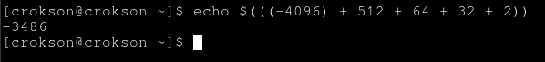

vậy còn số nhị phân `011011000100` ta lập bảng :

| Bit vị trí | 11 | 10 | 9 | 8 | 7 | 6 | 5 | 4 | 3 | 2 | 1 | 0 |
|------------|----|----|---|---|---|---|---|---|---|---|---|---|
| số bit     | 0  | 1  | 1 | 0 | 1 | 1 | 0 | 0 | 0 | 1 | 0 | 0 |
|			 |    |    |   |   |   |   |   |   |   |   |   |   |
| Trọng số   | bỏ | 1024 | 512 | bỏ | 128 | 64 | bỏ | bỏ | bỏ | 4 | bỏ | bỏ |


từ bảng ta có làn lượt là : `1024 , 512 , 128 , 64 và 4`

tính tổng lại : `1024 + 512 + 128 + 64 + 4 = 1732`


**1.3.Miền giá trị biểu diễn được**

- Miền gía trị biểu diễn được là định nghĩa một dãy binary nó có thể chứa trọng số thấp nhất (MIN) và trọng số cao nhất (MAX) là bao nhiêu tính từ âm đến dương. Ví dụ với một dãy binary 4 bit :

4 bit có miền giá trị âm `1000` MSB = 1, tới dương `0111` MSB = 0 và để biết số nguyên nhỏ nhất và cao nhất thì ta có hai cách :

- 1. là chúng ta đếm thủ công hoặc là dịch binary ra ở các trang website, hoặc là dùng lệnh để dịch ra số nguyên

- 2. là chúng ta sử dụng biểu thức mà kiến trúc máy tính, CSAPP thường hay đề cập tới. Tính số nguyên cao nhất của binary 4 bit, ở đây ta dùng công thức là $$\Large2^{N}-1$$, nói sơ qua về công thức này thì:

	- `2` : là hệ cơ số của binary

	- `N` : là số lượng bit ví dụ ta muốn tính 4 bit như `0000 -> 1111` thì ta đưa số 4 vào

	- `-1` : bởi vì ta đếm từ số 0, nên N bit tạo ra hai giá trị khác nhau chênh lệch là 1.Nên giá trị lớn nhất của dãy binary là $$\Large2^{N}-1$$

Như thế công thức này dùng để tính giá trị của dãy nhị phân không dấu unsigned là `1111` nhưng chúng ta muốn tính dãy nhị phân có dấu signed là `0111` mà ? vậy thì chúng ta thực hiện trừ 1 thêm đi cho phép lũy thừa, phép toán chỉ xem và tính các dãy bit còn lại và không tính bit MSB , kết quả của biểu thức sẽ như vậy : $$\Large2^{N-1}-1$$

Và chúng ta tiến hành thực hiện tính toán : $$\Large2^{N-1}-1 = 7$$ và giá trị 7 này chính là giá trị lớn nhất của hệ binary 4 bit


vậy còn giá trị nhỏ nhất thì sao?

- Giá trị nhỏ nhất là phần mà bit MSB chạm 1, nghĩa là ta có `0111` là phần bit lớn nhất của số dương theo hệ có dấu signed rồi nhưng ta cộng 1 bit nữa là `1000` MSB = 1 , số âm là `-8` thì đó chính là phần nhỏ nhất rồi. Tương đương với công thức $$\Large-2^{N-1}$$

vậy từ các phép tính trên thì miền giá trị là `[-8 , 7]` theo số nguyên

một vài lưu ý mà tôi được thẩm từ cuốn CSAPP là, miền giá trị theo hệ signed mã bù hai là **không đối xứng** ví dụ ta có:

| miền giá trị 4 bit | -8 | -7 | -6 | -5 | -4 | -3 | -2 | -1 | 0 | 1 | 2 | 3 | 4 | 5 | 6 | 7 |
|--------------------|----|----|----|----|----|----|----|----|---|---|---|---|---|---|---|---|

tất nhiên theo bản, bạn thấy nó có 8 số âm và 8 số không âm nên là `TMin = -8` và `TMax = 7` vì sao bạn thấy có 8 số âm và không âm đều đều cả hai nhưng TMin và TMax lại có sự chênh lệch là 1 đơn vị ?

- **Nguyên nhân chính là số 0** số 0 thuộc miền không âm nhưng không làm tăng giá trị Tmax

**1.3.1.Áp dụng thử vào C**

- Nếu như ở trên là lý thuyết?, chúng ta tiến hành viết một chương trình C nhỏ để có thể tính toán các dãy bit trên hệ thống thật . Do hệ thống thật là 64 bit nhưng trong C các kiểu dữ liệu nó có 1 cái hay là có riêng cho nó một lượng byte riêng ví dụ `2 byte` là `short`, chúng ta sẽ ứng dụng short vào trong chương trình này. Cứ dịch ra trước `2 byte là 16 bit` và tính toán TMin và TMax trước đi đã

Tmin của 16 bit = $$\Large-2^{N-1}$$ = -32768

Tmax của 16 bit = $$\Large2^{N-1}-1$$ = 32767


```c
#include <stdio.h>

int main(void){
	short numbers = 32767; //là số Tmax của biến short 

	numbers += 1; //lúc này sẽ ra Tmin của short

	printf("%d\n",numbers);

	return 0;
}
```


Nó hoạt động đúng như những gì mà sách nói cũng như kỳ vọng của tôi

> [!NOTE]
> Ghi chú : ở đây theo chuẩn CPU hầu hết các thiết bị hiện đại thì nó đều dùng bù hai nên như bạn thấy trong ảnh là kết quả đúng là Tmin của 16bit, nhưng với theo cách nhìn của lập trình C điều này là UB vì phép toán này thuộc nhóm signed overflow

tương tự với nhiều kiểu dữ liệu có dấu khác:

| Kiểu        | Bit | Tmin                 | Tmax                |
| ----------- | --- | -------------------- | ------------------- |
| signed char | 8   | -128                 | 127                 |
| short       | 16  | -32768               | 32767               |
| int         | 32  | -2147483648          | 2147483647          |
| long long   | 64  | -9223372036854775808 | 9223372036854775807 |

> Debug chương trình C, nếu bạn ko quan tâm có thể bỏ qua

<details>
	<summary>Debug program C</summary>
chúng ta cùng debug nó xem cái gì nó đang thực sự diễn ra bên trong. Ở đây, chúng ta dùng công cụ GDB để debug từng dòng assemly :

> gdb -q test_type

và

> start

xong lệnh start nó sẽ thực thi tới đầu main nếu program còn symbol và chưa bị strip 

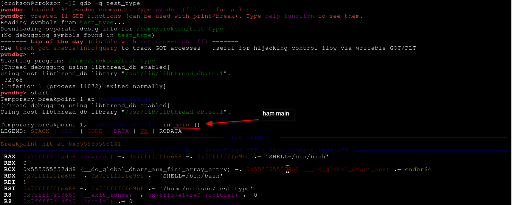

ở đoạn disassembly, chúng ta thấy pwndbg nó có hiện sẵn các vaddr và hexdecimal, tính cộng như trong ảnh

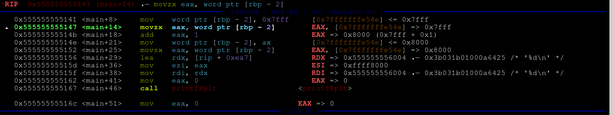

để có bằng chứng chương trình thực hiện đúng cơ chế và lý thuyết y như CSAPP nói và output thì chúng ta soi kỹ cách disassembly được đưa ra từ gdb nó cộng lại như thế nào và hoạt động nhị phân nó ra làm sao ở đây dựa trên các đoạn hợp ngữ trong ảnh, chúng ta chú ý tới phần này :

```asm
   0x555555555147 <main+14>    movzx  eax, word ptr [rbp - 2]        EAX, [0x7fffffffe54e] => 0x7fff
   0x55555555514b <main+18>    add    eax, 1                         EAX => 0x8000 (0x7fff + 0x1)
   0x55555555514e <main+21>    mov    word ptr [rbp - 2], ax         [0x7fffffffe54e] <= 0x8000
```

ở đây tại instrution `0x5147` ta thấy thanh ghi eax hiện tại đang chứa `0x7fff` chính là Tmax của kiểu dữ liệu 16 bit, để kết luận 0x7fff chính là Tmax thì ta có bằng chứng như sau :

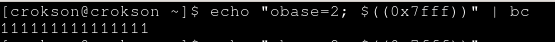

bạn thấy nó là dãy `111111111111111` và kết luận MSB = 1 rồi đúng không? tuy nhiên kết luận đó chưa đúng, tiếp theo xét instrution `0x514e` ta thấy sau khi nó cộng một đơn vị thì nó có giá trị `0x8000` đó chính là Tmin của binary 16bit, chứng minh nó là Tmin ta có bằng chứng như sau: 

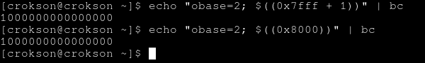

giờ đây quan sát hai giá trị tmax và tmin , chúng ta lấy output ở ảnh 0x8000 là `1000000000000000` đi so sánh với ảnh trước là `111111111111111`, bạn thấy nó chênh lệch 1 đơn vị và phần `111111111111111` nó thấp hơn 1 đơn vị. Để dễ dàng cho việc so sánh ta sẽ sắp xếp nó và thêm số 0 vào cho chuẩn 16 bit  :

| Tmax |0111111111111111|
|------|----------------|
| Tmin |1000000000000000|

- Bạn thấy MSB của cả hai bị chênh lệch 1 đơn vị, và bây giờ chúng ta `ni` tiếp tới printf() được gọi xem cái gì diễn ra


chúng ta thấy có một điểm lạ, tại sao nó lại thêm `0xffff` vào ?

> đoạn này giải thích câu hỏi và thiên hướng về C có thể hơi ngoài lệ, bạn có thể bỏ qua nếu không quan tâm tới

<details>
	<summary>Lý do C lại thêm 0xffff</summary>

- Bởi vì trong C có cơ chế interger promotion, khi ta truyền type short vào printf, nó sẽ tự động ép sang kiểu int. Mà, tại vì sao nó phải làm vậy?

**trước hết chúng ta phải hiểu variadic function trong C là gì đã**

- Variadic function trong C, có tác dụng nhận các tham số không cố định, thường được khai báo trong các tập tin tiêu đề header (.h) thường ở các thư viện, nhận diện chúng bằng cách thấy ký hiệu `...` ở các slot argument kế tiếp. Mục đích của cái này là tiếp nhận tất cả biến có kiểu dữ liệu khác nhau, ví dụ hình hài của nó theo tiêu đề được khai báo sẵn trong hệ thống linux :


> gọn hơn : dấu ... nghĩa là sau các tham số cố định, có thể truyền thêm bao nhiêu đối số tùy ý.

**Nếu như thế thì nó liên quan gì tới việc thêm 0xffff vào vaddr?**

- Khi ta truyền short vào printf, nó không biết đó là short nó chỉ biết một đống đối số sau `const char` và chuẩn C quy định, trước khi truyền vào hàm variadic thì các kiểu dữ liệu sau bị ép sang int :

| các type bị ép sang int |
|-------------------------|
| signed char | 
| unsigned char | 
| unsigned short |
| char |
| short |

Còn float thì bị ép thành double. Vậy ép xong rồi sao nó thêm `ffff`?

- phải nhắc tới `sign extension` ở đây. Chúng ta cần biết sign extension là sao đã, nó là một loại có thể kéo các dải bit khi thực hiện tăng các bit lên, dễ hiểu hơn là tôi sẽ cho một bảng như sau :

| bit gốc 		 | 1000 | 100 | 10 |
|----------------|------|-----|----|
| bit được tăng độ rộng toán hạng | 00001000 | 0000100 | 000010 |
| sign extension | 11111000 | 1111100 | 111110 |

ví dụ tôi cho nó là kiểu `a` đi, kiểu `a` có 4 bit là `0000 -> 1111`, bây giờ tôi cho kiểu `a` có giá trị là $$\Large Tmin = -2^{N-1}$$ là `1000` đó là hình hài bit của nó. Vậy khi kiểu `a` ta ép kiểu nó sang kiểu `b` và kiểu b 8 bit (gấp đôi bit kiểu a) thì lúc này độ rộng toán hạng của nó là `11111000`. Đó là lý do đợt chạy debug vừa rồi nó thêm `0xffff` vì kiểu `short` theo quy định của C nó được ép sang kiểu `int` mà int gấp đôi short là 4 byte trong khi short có 2 byte thôi 

điều kiện để sign extension nó làm việc là MSB = 1 còn nếu MSB = 0 thì đó là của zero extension làm việc, nếu sign nó kéo dài với bit 1 thì zero kéo dài với bit 0 thôi

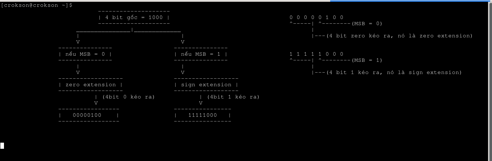

</details>

chúng ta tiếp tục `ni` và output sẽ giống y chang :


vì đơn giản đó là Tmin theo signed, và khi MSB = 1 rồi thì mọi con số đều là âm hết nếu theo hệ bù hai signed
 
</details>

**1.4.Chuyển đổi giữa unsigned và signed**

- Mọi binary ví dụ `11111111` đều có thể được diễn giải khác nhau tùy kiểu dữ liệu, bù hai signed diễn giải nó là `-1` nhưng theo unsigned nó là `255` nhưng bit nó vẫn là `11111111` không thay đổi ở bậc nhị phân, chỉ có cách diễn giải mới là bậc thay đổi vì thế gía trị cũng thay đổi theo

- chỉ là diễn giải cách đọc khác nhau khi làm việc với bit. Ví dụ :

ta có số `10` bây giờ hãy đọc nó theo hệ thập phân `mười` nhưng đọc nó theo hệ nhị phân `hai` số đó vẫn là `10` không chỉnh gì thêm chỉ khác cách đọc. Cách sát hơn nữa là `unsigned` và `signed`, ta có bảng so sánh như sau :

|binary | 11111111 | 10000001 | 10 |
|-------|----------|----------|----|
| signed | -1 | -127 | -2 |
| unsigned | 255 | 129 | 2 |

dựa theo bảng, chúng ta có thể thấy bit vẫn là bit, nó vẫn giữ nguyên đó không chỉnh sửa. Nhưng, giá trị bị thay đổi bởi vì 2 cách đọc hệ khác nhau 

- Ở trong sách CS:APP, người ta còn đề cập tới là chuyển đổi kiểu đọc giữa unsigned và signed


nhìn vào dòng mã mà họ đưa trong sách :

```c
For example, consider the following code:

 	short int v = -12345;
 	unsigned short uv = (unsigned short) v;
	printf("v = %d, uv = %u\n", v, uv);
```

> When run on a two’s-complement machine, it generates the following output:

> v = -12345, uv = 53191

Chúng ta có thể hiểu theo minh họa là, khi ta khai báo cái biến `v` với số âm = -12345 thì nó vẫn là số âm, nhưng khi ta ép nó sang unsigned là `unsigned short uv = (unsigned short) v;` thì nó chuyển sang gía trị khác là số dương nhưng số bit vẫn giữ nguyên. Vậy bằng chứng nào mà tôi dám nói số bit giữ nguyên? ta sẽ chứng minh nó. Ở đây sách đã cho output và đoạn mã, ta sẽ thử thực thi lại xem ra output terminal và chứng minh nó :

> phần chứng minh, nó có thể hơi ngoài lề bạn có thể bỏ qua

<details>
	<summary>Chứng minh</summary>

code của tôi lấy cảm hứng ví dụ như trong code minh họa CS:APP cung cấp :

```c
#include <stdio.h>

int main(void){

	short int v = -12345;
 	unsigned short uv = (unsigned short) v; // code y nguyên như trong sách 
	printf("v = %d, uv = %u\n", v, uv);

	return 0;
}
```

> gcc -o test_type test_type.c


Như trong ảnh, output đã chính xác như sách đưa. Vậy tới phần chứng minh là binary có phải giữ nguyên như tôi nói không, hay các lý thuyết như trong sách có vận hành đúng không ta sẽ chứng minh nó bằng cách dịch số nguyên không dấu sang nhị phân và thực hiện tính toán :

> echo "obase=2; $((53191))" | bc


số nhị phân là `1100111111000111` 16 bit đúng type của short là 2 byte, giờ tới phần tính toán số có dấu xem kết quả tính toán có đúng như tôi nói là số nhị phân giữ nguyên ko nhé :

tính toán bit có dấu signed 

| vị trí bit | 15 | 14 | 13 | 12 | 11 | 10 | 9 | 8 | 7 | 6 | 5 | 4 | 3 | 2 | 1 | 0 |
|------------|----|----|----|----|----|----|---|---|---|---|---|---|---|---|---|---|
| số bit     | 1  | 1  | 0  | 0  | 1  | 1  | 1 | 1 | 1 | 1 | 0 | 0 | 0 | 1 | 1 | 1 |
| value = $$2^{N}$$ | -32768 | 16384 | bỏ | bỏ | 2048 | 1024 | 512 | 256 | 128 | 64 | bỏ | bỏ | bỏ | 4 | 2 | 1 |

từ value trên bảng cộng tổng lại : `(-32768) + 16384 + 2048 + 1024 + 512 + 256 + 128 + 64 + 4 + 2 + 1 = -12345`


kết quả ra `-12345` chính xác với kết quả mà CSAPP cho. Suy ra, kết luận của tôi `binary giữ nguyên` là đúng


</details>

từ đó cũng như thế thôi, bit nhị phân vẫn y nguyên là nó. Cách đọc mới quyết định giá trị của nó là gì và chính cách đọc mới thay đổi, chúng ta có thể chuyển đổi được cách đọc bởi vì nhị phân đã đổi đâu? nên đọc một đoạn mã đó vẫn có thể thây đổi được

> nếu bạn cần tìm hiểu thêm về T2U và U2T thì có thể đọc

<details>
<summary>T2U và U2T</summary>


trong CSAPP có đề cập tới hai khái niệm này. T2U có nghĩa là chuyển số có dấu signed sang số không dấu unsigned 

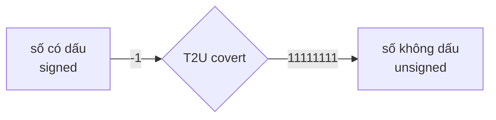

trước hết ta có biểu thức của T2U là :

nếu **x < 0** thì

 $$\Large x + 2^{N}$$

nếu **x >= 0** thì

 vẫn **giữ nguyên x**

trong đó x là **giá trị số nguyên N** là số bit $$\Large2^{N}$$ là biểu thức **tính gía trị bit tràn** ví dụ 4 bit nó sẽ tính `10000` là bao nhiêu cái $$\Large2^{N}$$ khác với $$\Large2^{N}-1$$ là nó tính **số bit tràn** `10000` còn biểu thức `-1` kia ý là **tính toàn diện bit** `1111`. Nói sơ qua thì T2U chủ yếu covert cái số có dấu (signed) sang không dấu (unsigned) điển hình là số âm sang số dương, nếu số âm thì nó sẽ chuyển đổi còn nếu số dương thì nó giữ nguyên gồm cả 0.


số bit của short là 16bit, vậy ta biết số có dấu Tmin của 16bit là $$\Large-2^{16 - 1} = -32768$$ do `-32768` bé hơn `0`, bây giờ ta muốn chuyển chúng sang hệ không dấu unsigned thì ta dùng biểu thức T2U :

$$\huge(-32768) + 2^{16} = 32768$$


còn nếu mà số nguyên như 100 lớn hơn 0 thì giữ nguyên. Nó sẽ là kết quả bị sai dù covert đúng hay không nhưng về bản chất là sai, không phải vì biểu thức sai mà vì điều kiện không cho phép áp dụng biểu thức với điều đó

Vậy ví dụ ta thử tính xem chuyện gì xảy ra biết rõ ràng 100 lớn hơn 0, điều kiện ko cho phép vậy ta vẫn cứ tính xem có gì?

$$\huge100 + 2^{16} = 65636$$ **(kết quả bị sai dù covert đúng)**

Bạn thấy số đã chuyển sang số không dấu unsigned

còn U2T thì ngược lại thôi, nó chuyển unsigned sang signed 

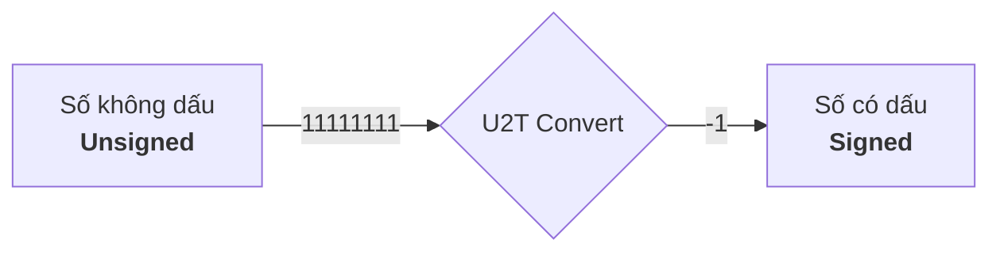

công thức của nó là :

nếu **x <** $$\Large2^{N-1}$$ thì

giữ nguyên

nếu **x >=** $$\Large2^{N-1}$$ thì

$$\Large x - 2^N$$

trong đó x là **số bit** , nếu như x mà **nhỏ hơn Tmax** của binary thì giữ nguyên còn mà nếu x mà **lớn hơn Tmax** của binary thì dùng công thức U2T .Ví dụ với cái bit như trên là 16 bit đi :

ở đây cho x = 32768 , 32768 **bằng** với $$\Large2^{N-1} = 2^{16-1} = 32768$$ lúc này ta mới dùng biểu thức U2T :

$$\huge32768 - 2^{16} = -32768$$ **(Bạn thấy nó đã covert sang âm)**


còn mà nếu ta dùng số nguyên bé hơn Tmax của binary thì không được, ví dụ ta có số nguyên là 100 bé hơn $$\Large2^{N-1} = 2^{16-1} = 32768$$ thì thử tính :

$$\huge100 - 2^{16} = -65436$$ **(suy ra nó sai dù vẫn là convert nhưng kết quả nó bị sai)**

Nên là hai cái U2T và T2U đều có điều kiện rõ ràng mới có thể tính ra kết quả chính xác được

Bạn thấy nó đã chuyển lại sang âm rồi, vậy tôi cũng đang thắc mắc là 

**chúng ta có thể thêm âm thủ công được mà? cần gì tới mấy công thức này cho rườm rà, vậy mục đích của CSAPP muốn dạy chúng ta là mấy biểu thức này và liệu nó có tác dụng gì?**

- CPU chỉ hiểu chuỗi bit 0 và 1, nó không biết số nào là âm hay dương. Cùng một dãy bit, tùy thuộc vào cách diễn giải (signed hay unsigned) mà giá trị sẽ khác nhau. T2U và U2T chính là hai công thức toán học mô tả sự thay đổi giá trị đó.

- U2T và T2U giúp ta biết chương trình thế nào nếu đổi cách đọc. Ví dụ điều kiện so sánh, khi so sánh `-1 < 1U` thì đâu biết compile nó tối ưu những gì đâu ? nếu nó tối ưu `-1` là unsigned thì short 16bit `1111111111111111` là một số khác, tính công thức $$\Large2^{16}-1$$ là `65535` thì `65535 < 1` là sai lúc đó else luôn đúng. Logic bị bẻ cong

- CSAPP dạy hai biểu thức này không phải tính thủ công từng cái một, mà là để dự đoán và debug một chương trình dễ dàng hơn khi gặp mấy trường hợp diễn giải binary của chương trình.

> Phần debug để chứng minh chương trình tối ưu hóa và phá logic bởi cách đọc là như thế nào , bạn có thể bỏ qua nếu ko quan tâm đến

<details>
	<summary>Debug chứng minh bug signed,unsigned</summary>

```c
#include <stdio.h>

int main(void){
		if(-1 < 1U){
			printf("hợp lệ \n");
		}else{printf("ko hợp lệ, lỗi diễn giải\n");}
	return 0;
}
```

> gcc -o test_type test_type.c

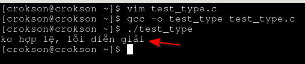

như trên ảnh, lỗi đã xảy ra. Lý do sao nó xảy ra thì chúng ta tiến hành debug nó 

> gdb -q ./test_type

và

> start

chúng ta sẽ ở instrution là `0x55555555513d` nghĩa là bắt đầu logic sau khi đã push và lưu thanh ghi rbp.


ở đây có điều bất ngờ là trong C gốc có điều kiện so sánh if nhưng disas ra lại thấy như này 


nó hardcode mặc định trong chương trình là `"ko hợp lệ, lỗi diễn giải\n"` với puts trực tiếp và thoát, ko có điều kiện nào ở trong đó. Chứng minh vấn đề là đây nhưng quan trọng nhất là tại sao nó lại hardcode, chúng ta tiến hành debug quá trình compile gcc biên dịch chương trình của chúng ta ra sao.

> gcc -save-temps -fdump-tree-original test_type.c -o test_type

chúng sẽ biên dịch lại nhưng sẽ tạo các file soi quá trình biên dịch như sau :


- file đuôi .i : là file ghi lại compiler xóa hết ghi chú comment và chỉ thị có dấu như # như #include #define, chúng sẽ chèn tất cả code thư viện lên đầu dòng mã.

- file đuôi .s : là file hợp ngữ assembly

- file đuôi .o : là file nhị phân liên kết, dùng để liên kết bằng ld 

- file đuôi .original : là file chương trình mà compile log lại trước khi dịch chúng sang mã máy để thực thi

Bây giờ, chúng ta tiến hành `cat` file .original ra trước :

> cat test_type.c.006t.original


Bạn thấy `if(0)` hardcode thẳng là 0 luôn cơ mà, nghĩa là compile đã thực hiện trước đó rồi, trước cả khi log các file này lại còn về phía printf, các sequences đều bị enocode thành các mã opcode. Bây giờ chúng ta tiến hành soi cái file .s là file hợp ngữ ra xem sao :

> cat test_type.s


Quan sát, assembly att mà compile dịch ra có thể hơi khác so với cái mà ta gặp hằng ngày, nhưng vấn đề là ta thấy logic của assembly nó ko hề có các câu điều kiện như `je` , `jne` v.v. mà chỉ là gắn vào rdi rồi call xong thoát. Đó là bằng chứng mạnh nhất để cho thấy trước khi các file log này được sinh ra thì compile đã tối ưu hóa và loại bỏ các câu điều kiện trước đó nữa rồi. Chúng ta cần debug sâu hơn nữa

Trích xuất tất cả các file debugs ra với lệnh :

> gcc -fdump-tree-all test_type.c -o test_type

nó sẽ ra các file như thế này. Các file này đều được push hết lên phần /debugs/


Ở đây, rất nhiều file. Chúng ta chỉ trinh thám mấy file cần thiết để lấy bằng chứng chứng minh compiler optimized chương trình, các file chúng ta có thể trinh thám là `test_type.c.273t.optimized`, `test_type.c.006t.original`, `test_type.c.024t.ssa`, `test_type.c.007t.gimple` hoặc đơn giản chúng ta dùng lệnh `grep` để grep tất cả file cho nhanh :

> grep -R "if" test_type.*


ở đây, tại các file mã nguồn .c và .i vẫn là nó, .c là gốc mã nguồn còn .i thì compiler chỉ trích xuất và chèn tất cả nội dung của file tiêu đề lên đỉnh của src gốc thôi nó chưa động chạm gì tới mã nguồn, nhưng về các file sau nghĩa là giai đoạn sau đó thì if bắt đầu biến thành `if(0 != 0)`. Rõ ràng là compiler nó đã chuyển sang 0 trước đó nữa rồi

chúng ta thử đổi ngược lại câu điều kiện xem sao :

```c
#include <stdio.h>

int main(void){
		if(-1 > 1U){ //đổi ngược < thành >
			printf("hợp lệ \n");
		}else{printf("ko hợp lệ, lỗi diễn giải\n");}
	return 0;
}
```

> gcc -o test_type test_type.c


chúng ta quan sát, thấy in ra từ hợp lệ. Vậy điều kiện `-1 > 1U` hay `-1 < 1U` thì khi biên dịch, compiler sẽ đổi cách đọc nó sẽ dựa trên tiêu chuẩn C để đổi cách đọc `-1` hệ có dấu sang hệ không dấy , lúc này nó là số âm nhưng khi bị ép sang hệ không dấu unsigned thì nó sẽ ra số nguyên dương = $$\Large2^N-1$$ bao quát toàn bộ dãy binary. Nên `-1` thành số lớn hơn rất nhiều ví dụ :

- ta có một đoạn mã C nhưng nó khai báo short 2byte là 16bit, điều kiện so sánh là `-1 < 1U`, compiler ép `-1` sang usigned gọi là `(unsigned)-1 < 1U` lúc này 16 bit có số nguyên bằng $$\Large2^{16}-1 = 65535$$ thì ta đang so sánh `65535 < 1` nên điều kiện luôn sai. Thì hai đoạn trên cũng thế, chỉ là compiler và chuẩn C sẽ thực hiện ép sang int thôi.


**Vậy vai trò của T2U và U2T ở đây là gì? có hai đoạn mã vậy chúng ta có thể vận dụng nó vào đó như thế nào?**

- Vai trò của T2U và U2T là dự đoán trước điều gì xảy ra khi dùng `-1 > 1U`, vì `-1 < 0` chúng ta có thể tính ra số kết quả bằng T2U với biểu thức $$\Large x + 2^{N}$$. **Nhưng vấn đề là tính ra số, nhưng làm sao để biết được cái nào cần nên tính. Ví dụ khi -1 được so sánh với 1U thì làm sao chúng ta có thể biết được là phép này là lỗi, phép này tính bằng T2U v.v.?** , vấn đề là khi khai báo `-1 > 1U` thì người bình thường rất dễ hiểu lầm và cho ra ngay kết quả toán học, nhưng ko ai biết được sau compile nó làm cái gì? từ đó khi chương trình thực thi nó sẽ ra kết quả là sai, đối nghịch và xung đột với sự kỳ vọng của họ, còn về phần cái nào cần nên tính thì chúng ta cần nhìn về kiểu dữ liệu, trong compile và chuẩn C khi thấy so sánh hai hạng khác kiểu hệ ví dụ `unsigned so sánh với signed` thì nó sẽ đổi kiểu đọc một trong hai kiểu so sánh sao cho chúng cùng hạng kiểu ví dụ `signed so sánh signed` hoặc `unsigned so sánh unsigned` , binary vẫn ở đó chỉ kiểu đọc thay đổi và giá trị cũng thay đổi theo điều này nói rõ ở mục `1.4.Chuyển đổi giữa unsigned và signed` . Vì thế T2U mới xuất hiện dùng để dự đoán trước kết quả so sánh

- T2U và U2T không phải là hai phép tính để thêm dấu này thêm dấu kia, nó đảm nhiệm vai trò là dự đoán kết quả trước khi compile được thực thi đúng hơn là CSAPP dạy cho người đọc hiểu cách compile hoạt động. Bởi lẽ, khi dự đoán được chính xác cái gì trước khi compile biên dịch nó thì chả phải đang hình dung và đọc chương trình như một compiler rồi sao?

</details>

> CPU nó không giữ một đống số nguyên hay gì hết, nó chỉ giữ một đống bit chỉ 0 và 1 quan trọng hơn nó không có khái niệm là âm hay dương chỉ có khái niệm bit. Về cơ bản, T2U và U2T chỉ giúp cho con người có thể dự đoán chính xác cái gì sẽ xảy ra khi làm việc với hệ số có dấu, ko dấu, kiểu đọc. Nó giúp chúng ta hiểu hơn về cách compiler biên dịch chương trình

</details>

**1.5.Vì sao gọi là mã bù hai?**

- Lúc đầu người ta tạo ra `mã bù một` loại mã bù một này diễn giải số âm bằng cách đảo bit . Ví dụ lấy `5 + (-5)` thì 5 có binrary là `0000101` và (-5) thì đảo bit lại là `1111010` và lấy hai phép đó cộng lại :

| số 5 | 0000101 |
|------|---------|
| số (-5) sau khi đảo bit | 1111010 |
| kết quả cộng lại | 1111111 |

nó không ra 0, kết quả đã sai rồi còn phải cộng thêm carry quay về rất phiền

- Sau đó, họ quyết định thử thêm sẳn cộng 1 vào xem thế nào. Ở đây, họ đảo bit và sau đó cộng thêm 1 ngay khi tạo số âm :

| số 5 | 0000101 |
|------|---------|
| số (-5) sau khi đảo bit | 1111010 |
| kết quả sau khi cộng thêm 1 | 1111011 |
| kết quả cộng lại | 10000000 |


bỏ bit ngoài đi, chúng ta có kết quả là 0. Đó là bù hai

> Phần này chủ yếu là lịch sử của bù hai

---

# Tràn số

- Tràn số là hiện tượng các số bit được dịch hoặc được cộng lên sang bên trái :

| số bit gốc | 00010001 |
|------------|----------|
| cộng 1     | 00010010 |
| dịch phải 1 | 00100010 |

- Điều đó bình thường và ko sai, nhưng sẽ có hậu quả nếu nó xảy ra hiện tượng ví dụ `overflow` , `signed wrap` . Thế hai hiện tượng này là gì?, overflow gồm hai phần `signed overflow` và `unsigned overflow` . còn signed wrap

**2.1 signed overflow và unsigned overflow**

**2.1.1 unsigned overflow**

- Là hiện tượng khi số nguyên không dấu tới quá hạn của số bit mà hệ thống cho phép. Nghĩa là, ví dụ khi hệ thống của tôi là archlinux 64bit, nó hỗ trợ 64bit thôi nếu ta vượt quá 64 bit này chẳng hạn như 65 bit đi thì lúc này số sẽ quy về 0 nghĩa là bit bên ngoài đã bị bỏ rồi 

**2.1.1.1 modulo $$\Large2^{N}$$**

- biểu thức $$\Large2^{N}$$ chúng ta đã nhắc nhiều ở mục trên rồi ví dụ nó giúp tính giá trị số bit bằng vị trí bit thì ở đây nó lại giúp chúng ta nhìn thấy hiện tượng unsigned overflow vượt quá giới hạn bit mà hệ thống hỗ trợ như thế nào, ví dụ hệ thống archlinux là 64bit đi thì ta dùng :

$$\huge2^{64} = 0$$


tại sao lại bằng 0?, do là chúng ta đã nhìn thấy hiện tượng unsigned overflow bây giờ hãy giải thích tại sao nó lại bằng 0. Vậy chúng ta hãy thử đổi con số kết quả của $$\Large2^{64}$$ sang số nguyên xem sao. Ở đây, ta sẽ lấy nó bằng cách trừ 1 đi với $$\Large2^{64}-1$$

$$\huge2^{64}-1 = -1$$


Hiện tượng bù hai xuất hiện, `11111111..` luôn là `-1` nếu MSB = 1 là âm, ở đây ta sẽ lấy `-1` luôn nhưng sẽ áp cho nó vô C . Cho đọan C sau :

```c
#include <stdio.h>

int main(void){
	long long a = -1;

	printf("%llu\n",(unsigned long long)a); /*lúc này là 2**64-1 là 
											`1111111111..` full hết bit*/

	a += 1;

	printf("%llu\n",(unsigned long long)a); //chúng ta quan sát, lúc này nó sẽ là 0 

	return 0;
}
```

> gcc -o test_64bit test_64bit.c ; ./test_64bit

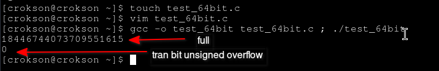

Đấy, chúng ta thấy nó bị tràn bit khi cộng lại. Vậy ta biết `18446744073709551615` là số nguyên không dấu của 64bit đó là giới hạn của nó, bị tràn là `18446744073709551616` vậy chúng ta thử echo hai số này thì hiện tượng nó vẫn xảy ra

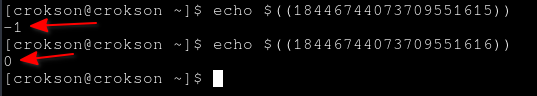

Cho ví dụ, hệ thống mới của chúng ta là 4 bit `0000 -> 1111` bây giờ tính $$\Large2^{4} = 10000$$, ta quan sát nó đã bị tràn ra bit số 5 quá mức mà hệ thống mới này hỗ trợ kết quả là hệ thống loại bỏ bit số 5 đi chỉ giữ lại đúng 4 bit là `0000` thôi kết quả là 0 cũng như thế với hiện tượng 64bit trên thôi. Cho số bit mà hệ thống mới này hỗ trợ là 4 bit là từ 0000 tới 1111 bây giờ ta lấy 0000 cho vào bảng để tính

| 4 bit | 0000 |
|-------|------|
| $$2^{4}$$ | 10000 |	


ở đây kết quả của biểu thức $$\Large2^{4}$$ . Nhưng kết quả này vượt quá sự cho phép của hệ thống 4bit và bit 1 bên ngoài bị loại bỏ, kết quả là `0000` = 0, vậy thì thử cộng thêm 1 xem sao :

| 4 bit | 0000 |
|-------|------|
| $$2^{4}+1$$ | 10001 |	


kết quả sẽ bằng 1 tại bit bên ngoài thật sự đã bị bỏ rồi là thành `0001`. 

> [!IMPORTANT]
> Nếu ta nhân hay cố làm với số lớn hơn ngưỡng bit mà hệ thống cho phép thì nó cũng sẽ giữ những bit, số trong ngưỡng bằng cách cắt những bit ngoài đi

> Chúng ta có thể áp dụng với kiểu dữ liệu C, nếu bạn muốn chi tiết hơn nữa

<details>
	<summary>áp dụng với C</summary>
Do hệ thống thực là 64bit nó quá lớn so với nhu cầu nên chúng ta sẽ thực hiện vận dụng các bit có hạn trong các kiểu dữ liệu để thực hiện hiện tượng này. Ở đây, chúng ta dùng short 2 byte, ta cho đoạn code C như sau :

```c
#include <stdio.h>

short luy_thua(short input, short intput_two){
	short temp = 1;
	for(int i = 1 ; i <= intput_two; i++){
	 temp *= input; //intput * 1 -> giữ nguyên nhân tiếp lần lượt là 2 - 3 - 4 
	} 
	return temp;
}

int main(void){
	short a = 1; /*lúc này ở đây, chúng ta thấy :
				 theo hệ nhị phân là 0000000000000001
				 Vẫn chưa tràn bit unsigend overflow */

	a ^= a; /*chúng ta dọn dẹp nó, ở đây bạn có thể gán 0
			 vô cũng được nhưng tus thích xor nó hơn*/

	a = luy_thua(2 , 15); /* đây mới xảy ra hiện tượng, hệ nhị phân là
						    10000000000000000 quá số bit, bây giờ in ra
							 xem hiện tượng nó cắt byte như nào */

	printf("%d\n",a); //ở đây in ra nhé

	a ^= a;

	a = luy_thua(2 , 16+16); /*tus nhớ short theo chuẩn C sẽ bị ép kiểu sang int
							   và sign extension ra vậy để phòng ngừa, 
								ta nên cộng thêm vô cho int*/

	printf("%d\n",a); //kết quả gần như chắc chắn sẽ xảy ra theo kỳ vọng

	return 0;
}
```

> gcc -o test_type test_type.c ; ./test_type

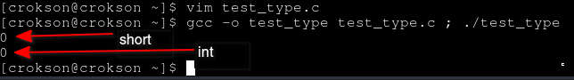

Chúng ta thấy output của cả hai đều là 0, vậy chứng tỏ nó đã bị tràn số vượt ngưỡng bit mà hai kiểu dữ liệu hỗ trợ rồi. Vậy, chúng ta vẫn đang thắc mắc là dù biết là short được ép sang int theo chuẩn C như đợt debug ở trên vậy tại sao cả hai đều là 0? short ở phần này ko được ép hay là tràn nữa à, mà nếu tràn nó là 1 chã nhẽ được sign extension lên độ rộng toán hạng cao hơn ?

> Trả lời câu hỏi và debug tại đây, nếu bạn ko quan tâm thì có thể bỏ qua

<details>
	<summary>Vì sao cả hai kiểu dữ liệu là 0? chả nhẽ nó đã sign extension rồi à?</summary>
- Trước hết là chúng ta debug chương trình đã 
</details>

</details>

**2.1.1.2 cờ CF (carry flag)**

**2.1.1.3 bit bị bỏ**

**2.1.1.4 áp dụng thử vào C**

**2.1.2 signed overflow**

**2.1.2.1 vượt miền Tmin/Tmax**

**2.1.2.2 cờ OF (overflow flag)**

**2.1.2.3 vì sao MSB đổi?**

**2.1.2.4 áp dụng thử vào C**