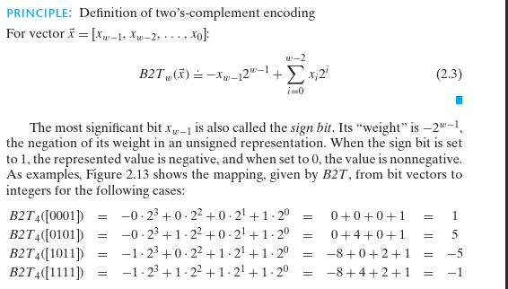
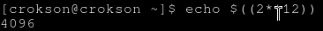

# CSAPP : mã bù hai và tràn số

**mục lục**

- 1.Mã bù hai

	- 1.1.Mã bù hai là gì và nguyên lý?

	- 1.2.

- 2.Tràn số

# Mã bù hai

**1.1.Mã bù hai là gì và nguyên lý?**

- Mã bù hai là cách biểu diễn signed của trọng số MSB luôn là số âm. Nghĩa là, nếu `MSB = 1` đó là số âm còn `MSB = 0` đó là số dương

**nguyên lý**

chúng ta thấy có cái `SIGMA`, đó là công thức tính giá trị của một cái đoạn nhị phân signed ra số nguyên. Nghĩa là, 1 đoạn nhị phân `0001` ra số nguyên là `1` nhưng đoạn `1001` lại ra `-1` tại sao?

- Do tôi không biết tính sigma, đơn giản là tôi chưa học tới chương trình đó nên tôi sẽ thực hiện tính nhị phân theo cái cách mà tôi được học như sau :

giả sử tôi có một đoạn nhị phân signed có MSB là 1 : `1001001100010`

và một đoạn nhị phân signed nhưng lại có MSB là 0 : `011011000100`

vậy tôi sẽ tính toán nó để xem result của nó về số nguyên là gì :

với đoạn nhị phân 1 là 1001001100010 ta lập bảng
------------------------------------------------------------------
vị trí bit | 12 | 11 | 10 | 9 | 8 | 7 | 6 | 5 | 4 | 3 | 2 | 1 | 0|
------------------------------------------------------------------
các bit    |   1 |  0 |  0 | 1 | 0 | 0 | 1 | 1 | 0 | 0 | 0 | 1 | 0|
------------------------------------------------------------------

Trọng số lần lượt các bit : -4096 (Số MSB) , 2048, 1024... 

- cứ thế chia 2 lần lượt tới bit LSB, hoặc đơn giản dùng lũy thừa:

 `2**N`

- trong đó :

	- `2` : là cái hệ cơ số của binary ý

	- `N` : là các vị trí bit

Ví dụ : `2**12 = -4096` (do là signed thì MSB = 1 ta phải thêm âm vô) , bằng chứng cho kết quả :

