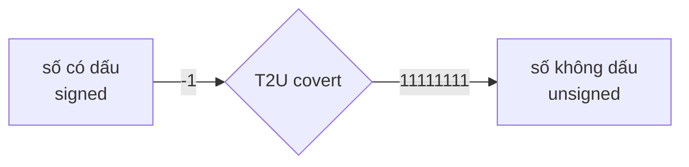
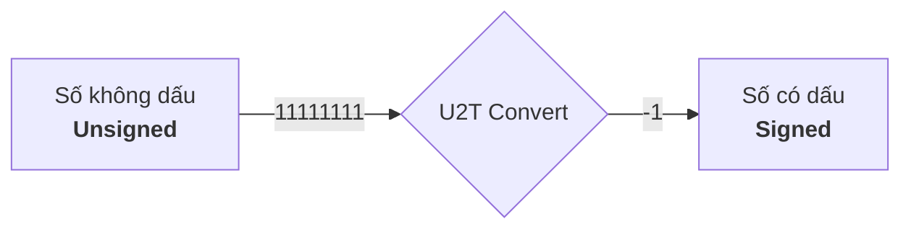

# CSAPP : mã bù hai và tràn số

**mục lục**

- 1.[Mã bù hai](#mã-bù-hai)

	- 1.1.Mã bù hai là gì ? (Two's Complement Encodings, 2.2.3 trang 99,100)

	- 1.2.Cách đọc bit parrent sang số nguyên ? (Unsigned Encodings, 2.2.2 trang 97,98)

	- 1.3.Miền giá trị biểu diễn được

	- 1.3.1.Áp dụng thử vào C

	- 1.3.2.Debug chương trình C

	- 1.4.Chuyển đổi giữa unsigned và signed (Conversions Between Signed and Unsigned, 2.2.4 trang 105,106)

	- 1.5.Vì sao gọi là mã bù hai?

- 2.Tràn số

# Mã bù hai

**1.1.Mã bù hai là gì?**

- Mã bù hai Bit MSB có trọng số $$\Large−2^{w−1}$$ biểu thức này dùng để tính Tmin của binary , các bit còn lại có trọng số dương như bình thường

- là cách biểu diễn signed của trọng số MSB luôn là số âm. Nghĩa là, nếu `MSB = 1` đó là số âm còn `MSB = 0` thuộc miền không âm (số 0) hoặc dương

**1.2. Cách đọc bit parrent sang số nguyên ?**


> trích từ sách CS:APP

chúng ta thấy có cái `SIGMA`, đó là công thức tính giá trị của một cái đoạn nhị phân signed ra số nguyên. Nghĩa là, 1 đoạn nhị phân `0001` ra số nguyên là `1` nhưng đoạn `1001` lại ra `-1` tại sao?

- thay vì dùng sigma như trong sách, ta sẽ tính thủ công trọng số và bit để xem cách hoạt động của nó :

giả sử ta có một đoạn nhị phân 13 bit signed có MSB là 1 : `1001001100010`

và một đoạn nhị phân 12 bit signed nhưng lại có MSB là 0 : `011011000100`

vậy ta sẽ tính toán nó để xem result của nó về số nguyên là gì :


với đoạn nhị phân 1 là `1001001100010` ta lập bảng :

| Bit vị trí | 12 | 11 | 10 | 9 | 8 | 7 | 6 | 5 | 4 | 3 | 2 | 1 | 0 |
|------------|----|----|----|---|---|---|---|---|---|---|---|---|---|
| bit        | 1  | 0  | 0  | 1 | 0 | 0 | 1 | 1 | 0 | 0 | 0 | 1 | 0 |


Trọng số lần lượt các bit : -4096 (Số MSB) , 2048, 1024... 

- cứ thế chia 2 lần lượt tới bit LSB, hoặc đơn giản dùng lũy thừa:

 $$\Large2^{N}$$

- trong đó :

	- `2` : là cái hệ cơ số của binary ý

	- `N` : là các vị trí bit

Ví dụ : $$\Large2^{12} = 4096$$ (tại sao làm việc ở mức MSB signed mà ta không thêm âm? do là mã bù hai bit MSB vốn đã có trọng số âm rồi) , bằng chứng cho kết quả :


- Để tiết kiệm thời gian, ta chỉ lấy những bit vị trí có bit là `1` thôi, chỉ xét các bit có giá trị 1 vì các bit 0 không đóng góp vào tổng trọng số. Dựa trên bảng bit thì chúng ta có những vị trí và trọng số của các bit 1 :

| Bit vị trí | 12 | 9 | 6 | 5 | 1 |
|------------|----|---|---|---|---|
| Trọng số   |  -4096 | 512 | 64 | 32 | 2 |


ta có lần lượt các trọng số bit 1 như sau : `-4096 , 512 , 64 , 32 , 2`

Và ta tiến hành cộng chúng lại để ra giá trị của chúng : `(-4096) + 512 + 64 + 32 + 2 = -3486` giá trị của bit `1001001100010` là `-3486`


vậy còn số nhị phân `011011000100` ta lập bảng :

| Bit vị trí | 11 | 10 | 9 | 8 | 7 | 6 | 5 | 4 | 3 | 2 | 1 | 0 |
|------------|----|----|---|---|---|---|---|---|---|---|---|---|
| số bit     | 0  | 1  | 1 | 0 | 1 | 1 | 0 | 0 | 0 | 1 | 0 | 0 |
|			 |    |    |   |   |   |   |   |   |   |   |   |   |
| Trọng số   | bỏ | 1024 | 512 | bỏ | 128 | 64 | bỏ | bỏ | bỏ | 4 | bỏ | bỏ |


từ bảng ta có làn lượt là : `1024 , 512 , 128 , 64 và 4`

tính tổng lại : `1024 + 512 + 128 + 64 + 4 = 1732`


**1.3.Miền giá trị biểu diễn được**

- Miền gía trị biểu diễn được là định nghĩa một dãy binary nó có thể chứa trọng số thấp nhất (MIN) và trọng số cao nhất (MAX) là bao nhiêu tính từ âm đến dương. Ví dụ với một dãy binary 4 bit :

4 bit có miền giá trị âm `1000` MSB = 1, tới dương `0111` MSB = 0 và để biết số nguyên nhỏ nhất và cao nhất thì ta có hai cách :

- 1. là chúng ta đếm thủ công hoặc là dịch binary ra ở các trang website, hoặc là dùng lệnh để dịch ra số nguyên

- 2. là chúng ta sử dụng biểu thức mà kiến trúc máy tính, CSAPP thường hay đề cập tới. Tính số nguyên cao nhất của binary 4 bit, ở đây ta dùng công thức là $$\Large2^{N}-1$$, nói sơ qua về công thức này thì:

	- `2` : là hệ cơ số của binary

	- `N` : là số lượng bit ví dụ ta muốn tính 4 bit như `0000 -> 1111` thì ta đưa số 4 vào

	- `-1` : bởi vì ta đếm từ số 0, nên N bit tạo ra hai giá trị khác nhau chênh lệch là 1.Nên giá trị lớn nhất của dãy binary là $$\Large2^{N}-1$$

Như thế công thức này dùng để tính giá trị của dãy nhị phân không dấu unsigned là `1111` nhưng chúng ta muốn tính dãy nhị phân có dấu signed là `0111` mà ? vậy thì chúng ta thực hiện trừ 1 thêm đi cho phép lũy thừa, phép toán chỉ xem và tính các dãy bit còn lại và không tính bit MSB , kết quả của biểu thức sẽ như vậy : $$\Large2^{N-1}-1$$

Và chúng ta tiến hành thực hiện tính toán : $$\Large2^{N-1}-1 = 7$$ và giá trị 7 này chính là giá trị lớn nhất của hệ binary 4 bit


vậy còn giá trị nhỏ nhất thì sao?

- Giá trị nhỏ nhất là phần mà bit MSB chạm 1, nghĩa là ta có `0111` là phần bit lớn nhất của số dương theo hệ có dấu signed rồi nhưng ta cộng 1 bit nữa là `1000` MSB = 1 , số âm là `-8` thì đó chính là phần nhỏ nhất rồi. Tương đương với công thức $$\Large-2^{N-1}$$

vậy từ các phép tính trên thì miền giá trị là `[-8 , 7]` theo số nguyên

một vài lưu ý mà tôi được thẩm từ cuốn CSAPP là, miền giá trị theo hệ signed mã bù hai là **không đối xứng** ví dụ ta có:

| miền giá trị 4 bit | -8 | -7 | -6 | -5 | -4 | -3 | -2 | -1 | 0 | 1 | 2 | 3 | 4 | 5 | 6 | 7 |
|--------------------|----|----|----|----|----|----|----|----|---|---|---|---|---|---|---|---|

tất nhiên theo bản, bạn thấy nó có 8 số âm và 8 số không âm nên là `TMin = -8` và `TMax = 7` vì sao bạn thấy có 8 số âm và không âm đều đều cả hai nhưng TMin và TMax lại có sự chênh lệch là 1 đơn vị ?

- **Nguyên nhân chính là số 0** số 0 thuộc miền không âm nhưng không làm tăng giá trị Tmax

**1.3.1.Áp dụng thử vào C**

- Nếu như ở trên là lý thuyết?, chúng ta tiến hành viết một chương trình C nhỏ để có thể tính toán các dãy bit trên hệ thống thật . Do hệ thống thật là 64 bit nhưng trong C các kiểu dữ liệu nó có 1 cái hay là có riêng cho nó một lượng byte riêng ví dụ `2 byte` là `short`, chúng ta sẽ ứng dụng short vào trong chương trình này. Cứ dịch ra trước `2 byte là 16 bit` và tính toán TMin và TMax trước đi đã

Tmin của 16 bit = $$\Large-2^{N-1}$$ = -32768

Tmax của 16 bit = $$\Large2^{N-1}-1$$ = 32767


```c
#include <stdio.h>

int main(void){
	short numbers = 32767; //là số Tmax của biến short 

	numbers += 1; //lúc này sẽ ra Tmin của short

	printf("%d\n",numbers);

	return 0;
}
```


Nó hoạt động đúng như những gì mà sách nói cũng như kỳ vọng của tôi

> [!NOTE]
> Ghi chú : ở đây theo chuẩn CPU hầu hết các thiết bị hiện đại thì nó đều dùng bù hai nên như bạn thấy trong ảnh là kết quả đúng là Tmin của 16bit, nhưng với theo cách nhìn của lập trình C điều này là UB vì phép toán này thuộc nhóm signed overflow

tương tự với nhiều kiểu dữ liệu có dấu khác:

| Kiểu        | Bit | Tmin                 | Tmax                |
| ----------- | --- | -------------------- | ------------------- |
| signed char | 8   | -128                 | 127                 |
| short       | 16  | -32768               | 32767               |
| int         | 32  | -2147483648          | 2147483647          |
| long long   | 64  | -9223372036854775808 | 9223372036854775807 |

**1.3.2.Debug chương trình C**

chúng ta cùng debug nó xem cái gì nó đang thực sự diễn ra bên trong. Ở đây, chúng ta dùng công cụ GDB để debug từng dòng assemly :

> gdb -q test_type

và

> start

xong lệnh start nó sẽ thực thi tới đầu main nếu program còn symbol và chưa bị strip 


ở đoạn disassembly, chúng ta thấy pwndbg nó có hiện sẵn các vaddr và hexdecimal, tính cộng như trong ảnh


để có bằng chứng chương trình thực hiện đúng cơ chế và lý thuyết y như CSAPP nói và output thì chúng ta soi kỹ cách disassembly được đưa ra từ gdb nó cộng lại như thế nào và hoạt động nhị phân nó ra làm sao ở đây dựa trên các đoạn hợp ngữ trong ảnh, chúng ta chú ý tới phần này :

```asm
   0x555555555147 <main+14>    movzx  eax, word ptr [rbp - 2]        EAX, [0x7fffffffe54e] => 0x7fff
   0x55555555514b <main+18>    add    eax, 1                         EAX => 0x8000 (0x7fff + 0x1)
   0x55555555514e <main+21>    mov    word ptr [rbp - 2], ax         [0x7fffffffe54e] <= 0x8000
```

ở đây tại instrution `0x5147` ta thấy thanh ghi eax hiện tại đang chứa `0x7fff` chính là Tmax của kiểu dữ liệu 16 bit, để kết luận 0x7fff chính là Tmax thì ta có bằng chứng như sau :


bạn thấy nó là dãy `111111111111111` và kết luận MSB = 1 rồi đúng không? tuy nhiên kết luận đó chưa đúng, tiếp theo xét instrution `0x514e` ta thấy sau khi nó cộng một đơn vị thì nó có giá trị `0x8000` đó chính là Tmin của binary 16bit, chứng minh nó là Tmin ta có bằng chứng như sau: 


giờ đây quan sát hai giá trị tmax và tmin , chúng ta lấy output ở ảnh 0x8000 là `1000000000000000` đi so sánh với ảnh trước là `111111111111111`, bạn thấy nó chênh lệch 1 đơn vị và phần `111111111111111` nó thấp hơn 1 đơn vị. Để dễ dàng cho việc so sánh ta sẽ sắp xếp nó và thêm số 0 vào cho chuẩn 16 bit  :

| Tmax |0111111111111111|
|------|----------------|
| Tmin |1000000000000000|

- Bạn thấy MSB của cả hai bị chênh lệch 1 đơn vị, và bây giờ chúng ta `ni` tiếp tới printf() được gọi xem cái gì diễn ra


chúng ta thấy có một điểm lạ, tại sao nó lại thêm `0xffff` vào ?

> đoạn này giải thích câu hỏi và thiên hướng về C có thể hơi ngoài lệ, bạn có thể bỏ qua nếu không quan tâm tới

<details>
	<summary>Lý do C lại thêm 0xffff</summary>

- Bởi vì trong C có cơ chế interger promotion, khi ta truyền type short vào printf, nó sẽ tự động ép sang kiểu int. Mà, tại vì sao nó phải làm vậy?

**trước hết chúng ta phải hiểu variadic function trong C là gì đã**

- Variadic function trong C, có tác dụng nhận các tham số không cố định, thường được khai báo trong các tập tin tiêu đề header (.h) thường ở các thư viện, nhận diện chúng bằng cách thấy ký hiệu `...` ở các slot argument kế tiếp. Mục đích của cái này là tiếp nhận tất cả biến có kiểu dữ liệu khác nhau, ví dụ hình hài của nó theo tiêu đề được khai báo sẵn trong hệ thống linux :


> gọn hơn : dấu ... nghĩa là sau các tham số cố định, có thể truyền thêm bao nhiêu đối số tùy ý.

Nếu như thế thì nó liên quan gì tới việc thêm 0xffff vào vaddr?

- Khi ta truyền short vào printf, nó không biết đó là short nó chỉ biết một đống đối số sau `const char` và chuẩn C quy định, trước khi truyền vào hàm variadic thì các kiểu dữ liệu sau bị ép sang int :

| các type bị ép sang int |
|-------------------------|
| signed char | 
| unsigned char | 
| unsigned short |
| char |
| short |

Còn float thì bị ép thành double. Vậy ép xong rồi sao nó thêm `ffff`?

- phải nhắc tới `sign extension` ở đây. Chúng ta cần biết sign extension là sao đã, nó là một loại có thể kéo các dải bit khi thực hiện tăng các bit lên, dễ hiểu hơn là tôi sẽ cho một bảng như sau :

| bit gốc 		 | 1000 | 100 | 10 |
|----------------|------|-----|----|
| bit được tăng độ rộng toán hạng | 00001000 | 0000100 | 000010 |
| sign extension | 11111000 | 1111100 | 111110 |

ví dụ tôi cho nó là kiểu `a` đi, kiểu `a` có 4 bit là `0000 -> 1111`, bây giờ tôi cho kiểu `a` có giá trị là $$\LargeTmin = -2^{N-1}$$ là `1000` đó là hình hài bit của nó. Vậy khi kiểu `a` ta ép kiểu nó sang kiểu `b` và kiểu b 8 bit (gấp đôi bit kiểu a) thì lúc này độ rộng toán hạng của nó là `11111000`. Đó là lý do đợt chạy debug vừa rồi nó thêm `0xffff` vì kiểu `short` theo quy định của C nó được ép sang kiểu `int` mà int gấp đôi short là 4 byte trong khi short có 2 byte thôi 

điều kiện để sign extension nó làm việc là MSB = 1 còn nếu MSB = 0 thì đó là của zero extension làm việc, nếu sign nó kéo dài với bit 1 thì zero kéo dài với bit 0 thôi

</details>

chúng ta tiếp tục `ni` và output sẽ giống y chang :


vì đơn giản đó là Tmin theo signed, và khi MSB = 1 rồi thì mọi con số đều là âm hết nếu theo hệ bù hai signed 

**1.4.Chuyển đổi giữa unsigned và signed**

- Mọi binary ví dụ `11111111` đều có thể được diễn giải khác nhau tùy kiểu dữ liệu, bù hai signed diễn giải nó là `-1` nhưng theo unsigned nó là `255` nhưng bit nó vẫn là `11111111` không thay đổi ở bậc nhị phân, chỉ có cách diễn giải mới là bậc thay đổi vì thế gía trị cũng thay đổi theo

- chỉ là diễn giải cách đọc khác nhau khi làm việc với bit. Ví dụ :

ta có số `10` bây giờ hãy đọc nó theo hệ thập phân `mười` nhưng đọc nó theo hệ nhị phân `hai` số đó vẫn là `10` không chỉnh gì thêm chỉ khác cách đọc. Cách sát hơn nữa là `unsigned` và `signed`, ta có bảng so sánh như sau :

|binary | 11111111 | 10000001 | 10 |
|-------|----------|----------|----|
| signed | -1 | -127 | -2 |
| unsigned | 255 | 129 | 2 |

dựa theo bảng, chúng ta có thể thấy bit vẫn là bit, nó vẫn giữ nguyên đó không chỉnh sửa. Nhưng, giá trị bị thay đổi bởi vì 2 cách đọc hệ khác nhau 

- Ở trong sách CS:APP, người ta còn đề cập tới là chuyển đổi kiểu đọc giữa unsigned và signed


nhìn vào dòng mã mà họ đưa trong sách :

```c
For example, consider the following code:

 	short int v = -12345;
 	unsigned short uv = (unsigned short) v;
	printf("v = %d, uv = %u\n", v, uv);
```

> When run on a two’s-complement machine, it generates the following output:

> v = -12345, uv = 53191

Chúng ta có thể hiểu theo minh họa là, khi ta khai báo cái biến `v` với số âm = -12345 thì nó vẫn là số âm, nhưng khi ta ép nó sang unsigned là `unsigned short uv = (unsigned short) v;` thì nó chuyển sang gía trị khác là số dương nhưng số bit vẫn giữ nguyên. Vậy bằng chứng nào mà tôi dám nói số bit giữ nguyên? ta sẽ chứng minh nó. Ở đây sách đã cho output và đoạn mã, ta sẽ thử thực thi lại xem ra output terminal và chứng minh nó :

> phần chứng minh, nó có thể hơi ngoài lề bạn có thể bỏ qua

<details>
	<summary>Chứng minh</summary>

code của tôi lấy cảm hứng ví dụ như trong code minh họa CS:APP cung cấp :

```c
#include <stdio.h>

int main(void){

	short int v = -12345;
 	unsigned short uv = (unsigned short) v; // code y nguyên như trong sách 
	printf("v = %d, uv = %u\n", v, uv);

	return 0;
}
```

> gcc -o test_type test_type.c


Như trong ảnh, output đã chính xác như sách đưa. Vậy tới phần chứng minh là binary có phải giữ nguyên như tôi nói không, hay các lý thuyết như trong sách có vận hành đúng không ta sẽ chứng minh nó bằng cách dịch số nguyên không dấu sang nhị phân và thực hiện tính toán :

> echo "obase=2; $((53191))" | bc


số nhị phân là `1100111111000111` 16 bit đúng type của short là 2 byte, giờ tới phần tính toán số có dấu xem kết quả tính toán có đúng như tôi nói là số nhị phân giữ nguyên ko nhé :

tính toán bit có dấu signed 

| vị trí bit | 15 | 14 | 13 | 12 | 11 | 10 | 9 | 8 | 7 | 6 | 5 | 4 | 3 | 2 | 1 | 0 |
|------------|----|----|----|----|----|----|---|---|---|---|---|---|---|---|---|---|
| số bit     | 1  | 1  | 0  | 0  | 1  | 1  | 1 | 1 | 1 | 1 | 0 | 0 | 0 | 1 | 1 | 1 |
| value = $$2^{N}$$ | -32768 | 16384 | bỏ | bỏ | 2048 | 1024 | 512 | 256 | 128 | 64 | bỏ | bỏ | bỏ | 4 | 2 | 1 |

từ value trên bảng cộng tổng lại : `(-32768) + 16384 + 2048 + 1024 + 512 + 256 + 128 + 64 + 4 + 2 + 1 = -12345`


kết quả ra `-12345` chính xác với kết quả mà CSAPP cho. Suy ra, kết luận của tôi `binary giữ nguyên` là đúng


</details>

từ đó cũng như thế thôi, bit nhị phân vẫn y nguyên là nó. Cách đọc mới quyết định giá trị của nó là gì và chính cách đọc mới thay đổi, chúng ta có thể chuyển đổi được cách đọc bởi vì nhị phân đã đổi đâu? nên đọc một đoạn mã đó vẫn có thể thây đổi được

> nếu bạn cần tìm hiểu thêm về T2U và U2T thì có thể đọc

<details>
<summary>T2U và U2T</summary>


trong CSAPP có đề cập tới hai khái niệm này. T2U có nghĩa là chuyển số có dấu signed sang số không dấu unsigned 



trước hết ta có biểu thức của T2U là :

nếu **x < 0** thì

 $$\Large x + 2^{N}$$

nếu **x >= 0** thì

 vẫn **giữ nguyên x**

trong đó x là **giá trị số nguyên N** là số bit $$\Large2^{N}$$ là biểu thức **tính gía trị bit tràn** ví dụ 4 bit nó sẽ tính `10000` là bao nhiêu cái $$\Large2^{N}$$ khác với $$\Large2^{N}-1$$ là nó tính **số bit tràn** `10000` còn biểu thức `-1` kia ý là **tính toàn diện bit** `1111`. Nói sơ qua thì T2U chủ yếu covert cái số có dấu (signed) sang không dấu (unsigned) điển hình là số âm sang số dương, nếu số âm thì nó sẽ chuyển đổi còn nếu số dương thì nó giữ nguyên gồm cả 0.


số bit của short là 16bit, vậy ta biết số có dấu Tmin của 16bit là $$\Large-2^{16 - 1} = -32768$$ do `-32768` bé hơn `0`, bây giờ ta muốn chuyển chúng sang hệ không dấu unsigned thì ta dùng biểu thức T2U :

$$\huge(-32768) + 2^{16} = 32768$$


còn nếu mà số nguyên như 100 lớn hơn 0 thì giữ nguyên. Nó sẽ là kết quả bị sai dù covert đúng hay không nhưng về bản chất là sai, không phải vì biểu thức sai mà vì điều kiện không cho phép áp dụng biểu thức với điều đó

Vậy ví dụ ta thử tính xem chuyện gì xảy ra biết rõ ràng 100 lớn hơn 0, điều kiện ko cho phép vậy ta vẫn cứ tính xem có gì?

$$\huge100 + 2^{16} = 65636$$ **(kết quả bị sai dù covert đúng)**

Bạn thấy số đã chuyển sang số không dấu unsigned

còn U2T thì ngược lại thôi, nó chuyển unsigned sang signed 



công thức của nó là :

nếu **x <** $$\Large2^{N-1}$$ thì

giữ nguyên

nếu **x >=** $$\Large2^{N-1}$$ thì

$$\Large x - 2^N$$

trong đó x là **số bit** , nếu như x mà **nhỏ hơn Tmax** của binary thì giữ nguyên còn mà nếu x mà **lớn hơn Tmax** của binary thì dùng công thức U2T .Ví dụ với cái bit như trên là 16 bit đi :

ở đây cho x = 32768 , 32768 **bằng** với $$\Large2^{N-1} = 2^{16-1} = 32768$$ lúc này ta mới dùng biểu thức U2T :

$$\huge32768 - 2^{16} = -32768$$ **(Bạn thấy nó đã covert sang âm)**


còn mà nếu ta dùng số nguyên bé hơn Tmax của binary thì không được, ví dụ ta có số nguyên là 100 bé hơn $$\Large2^{N-1} = 2^{16-1} = 32768$$ thì thử tính :

$$\huge100 - 2^{16} = -65436$$ **(suy ra nó sai dù vẫn là convert nhưng kết quả nó bị sai)**

Nên là hai cái U2T và T2U đều có điều kiện rõ ràng mới có thể tính ra kết quả chính xác được

Bạn thấy nó đã chuyển lại sang âm rồi, vậy tôi cũng đang thắc mắc là 

**chúng ta có thể thêm âm thủ công được mà? cần gì tới mấy công thức này cho rườm rà, vậy mục đích của CSAPP muốn dạy chúng ta là mấy biểu thức này và liệu nó có tác dụng gì?**

- Thực ra, Cpu về cơ bản nó chỉ hiểu 0 và 1, gọi là binary như mục **1.4 chuyển đổi unsigned và signed** và CSAPP có nói, binary về cơ bản không hề thay đổi nó cố định là nó, nhưng chính cách đọc nó mới thay đổi và quyết định giá trị cuối cùng của nó. **Vậy nó liên quan gì tới câu hỏi?** Dĩ nhiên nó liên quan, vì khi câu hỏi được đặt ra chứng tỏ họ nghĩ CPU xử lý số nguyên, số thập phân nhưng ko phải vậy. 

- T2U và U2T xuất hiện không phải chỉ để biến số nguyên là âm hay dương, nó đảm nhiệm vai trò chuyển đổi cách đọc ví dụ binary `1111` về cơ bản nếu là bù hai có dấu nó là `-1` nhưng theo hệ không dấu unsigned nó là `15`. **Vậy đồng ý nó thay đổi cách đọc, thế nó giúp gì ?**

- Cái U2T và T2U mà tác giả đưa giúp chúng ta biết được chương trình nó sẽ như thế nào nếu thay đổi cách đọc. Ví dụ điều kiện so sánh, khi ta so sánh `-1 < 1U` thì đâu biết compile ra nó tối ưu những gì đâu ? nếu nó tối ưu `-1` là unsigned thì short 16bit `1111111111111111` là một số cực kỳ khủng tính công thức $$/Large2^{16}-1$$ ra là `65535` thì nó làm thế thì logic chương trình bị bẻ cong hoàn toàn rồi `65535 < 1` là sai hoàn toàn lúc đó else luôn đúng.

> Phần debug để chứng minh chương trình tối ưu hóa và phá logic bởi cách đọc là như thế nào , bạn có thể bỏ qua nếu ko quan tâm đến

<details>
	<summary>Debug chứng minh bug signed,unsigned</summary>

</details>

> CPU nó không giữ một đống số nguyên hay gì hết, nó chỉ giữ một đống bit chỉ 0 và 1.

</details>

**1.5.Vì sao gọi là mã bù hai?**